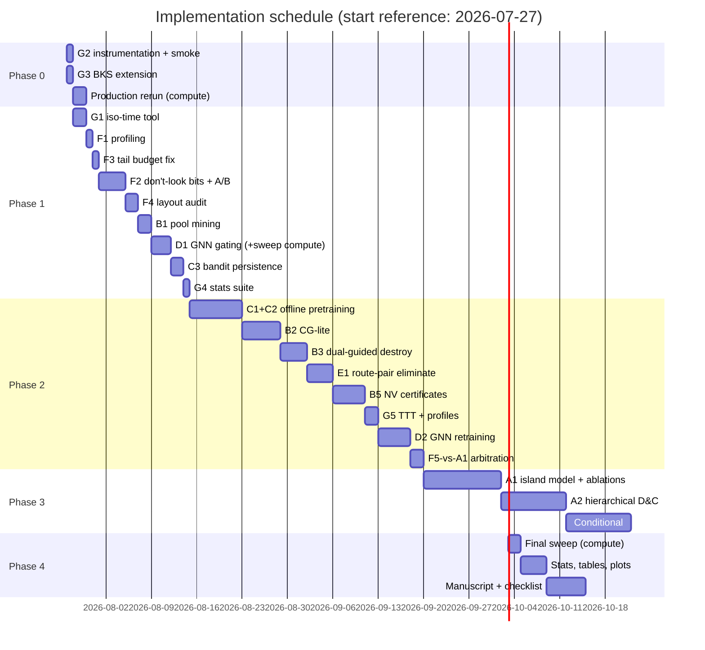

# Research Roadmap — Optimizing the Hybrid DDQN-ALNS VRPTW Solver

> **Scope rule (project owner, binding):** all improvements must build on the existing
> Hybrid DDQN-ALNS architecture. Only *additive/combined* algorithms are allowed —
> wrappers, new operators, auxiliary learned components, exact-method add-ons,
> pre-training of the existing networks, and engineering speedups. **No replacement of
> the core** (no PPO/SAC/Transformer policy swap, no ALNS replacement).
>
> Spec satisfied: `plan_estimated` (repo root). Language: English. Prepared 2026-07-23.

---

## Table of Contents

1. [Executive Summary & Top-10](#1-executive-summary)
2. [Constraints and Design Rules](#2-constraints-and-design-rules)
3. [System Snapshot](#3-system-snapshot)
4. [Idea Catalog (27 cards, tracks A–G)](#4-idea-catalog)
5. [Dependency Graph](#5-dependency-graph)
6. [Difficulty Matrix](#6-difficulty-matrix)
7. [Priority Matrix (ROI)](#7-priority-matrix)
8. [Phased Roadmap, Schedule & Task Decomposition](#8-phased-roadmap-and-schedule)
9. [Paper Contribution Mapping](#9-paper-contribution-mapping)
10. [Proof-of-Effectiveness Protocol](#10-proof-of-effectiveness-protocol)
11. [Publication Readiness Checklist](#11-publication-readiness-checklist)
12. [Risk Register](#12-risk-register)
13. [Appendix: Killed Ideas & References](#13-appendix)

---

## 1. Executive Summary

### 1.1 The three governing facts

Every estimate in this roadmap is anchored to three facts already established by paired
experiments in this repository (see `docs/RERUN_CHECKLIST.md`, `plan.md`):

- **F1 — Runtime is quality.** The 2.62× speedup (90 paired runs, bit-identical
  solutions) converts into quality only when reinvested as extra search: doubling the
  iteration budget 400→800 reduced mean vehicles 13.400→13.289 (Wilcoxon p=0.018) and
  gap-at-matched-NV 3.55%→3.12%. TD converges early; **NV does not** — extra search
  buys vehicles. Any idea that speeds up the solver inherits this conversion channel.
- **F2 — The iso-time golden rule.** Search-quality changes must be evaluated at
  **equal wall clock**, not equal iterations. The sawtooth destroy schedule won
  iso-iteration and *lost* iso-time; SISR and the kNN candidate-route filter died the
  same way. Four ideas are already closed as negative results (§2.2) and must not be
  re-proposed.
- **F3 — Phase 0 is the universal baseline.** All numbers in `docs/paper.tex` are
  stale pending the ~16 h production rerun (`run_full_production.sh` →
  `results/clean_v2`, 164 instances). Every idea below is measured against that
  regenerated baseline. **One day of passive instrumentation before launching the
  rerun (G2) turns its 16 h of compute into three reusable datasets** (RL
  transitions, elite solutions, convergence traces) — the highest-leverage single day
  in this plan.

### 1.2 Top-10 highest-impact improvements (ordered)

| # | ID | Idea | Why it is top-10 | Difficulty | Est. effort |
|---|----|------|------------------|-----------|-------------|
| 1 | G1 | Iso-time A/B tool (`scripts/ab_time.py`) | Near-zero cost; gates every other idea; codifies F2 | Easy | 1–2 d |
| 2 | G2 | Phase 0 passive instrumentation bundle | 1 day that turns 16 h of committed compute into the offline-RL dataset, GNN labels, and convergence traces | Easy | 1 d |
| 3 | F2 | Don't-look bits + first-improvement LS sweeps | Largest untouched lever on the proven runtime→quality channel (F1) | Medium | 3–4 d |
| 4 | F3 | Tail-phase budget enforcement fix | Trivial; without it every iso-time claim is soft (8% overrun at n=1000) | Easy | 0.5–1 d |
| 5 | G3 | BKS table extension H400–H1000 (SINTEF) | One day to make the scalability shards interpretable (gap-to-BKS currently blind above H200) | Easy | 1 d |
| 6 | C1 | Offline pretraining of the existing DDQN controllers | Save/load infra already exists; attacks the NV-critical early iterations | Medium | 5–7 d |
| 7 | B3 | Dual-guided destroy (LP duals → customer removal) | Best novelty-per-day; the matheuristic bridge reviewers will remember | Medium | 3–4 d |
| 8 | A1 | Island-model parallel multi-start with elite + experience sharing | Biggest expected quality delta (≥2×-budget-equivalent per F1); paper-level contribution | Hard | 8–12 d |
| 9 | D1 | GNN per-family gating | Cheapest way to stop a measured −0.22 pp harm; starts the "when does learning help" story | Easy–Med | 2–3 d |
| 10 | B5 | NV lower-bound optimality certificates | Converts the headline NV claim into provable statements where BKS is silent (H400+) | Medium | 4–5 d |

Near-misses: B2 (CG-lite — enters anyway as B3's dependency), E1 (route-pair
elimination destroy — NV-targeted but SISR-shaped risk), G4/G5 (Friedman + TTT plots —
mandatory for Phase 4 regardless of rank).

---

## 2. Constraints and Design Rules

### 2.1 The additive-only constraint

Owner statement (verbatim, translated): *"Improvements must be based on the existing
technical topic (DDQN-ALNS). Only combined/complementary algorithms may be ADDED — the
core must not be completely changed."*

**In scope:** new destroy/repair operators (the codebase's own extension pattern —
`DESTROY`/`REPAIR` lists in `src/vrptw/operators.py`), wrappers around
`HybridDDQNSolver.solve`, auxiliary learned scorers (the `LearnedAcceptanceCriterion`
is the in-repo template), warm-starting/pretraining the *existing* nets via the
*existing* `state_dict` save/load surface (`src/vrptw/solvers.py:410–564`), extensions
of the *existing* set-partitioning layer (`src/vrptw/pool.py`), state-vector feature
additions, HPC/engineering work, and evaluation tooling.

**Out of scope:** replacing DDQN with PPO/SAC/full Rainbow; replacing the
dual-controller hierarchy with a Transformer policy; replacing ALNS or the
lexicographic NV-then-TD objective.

**Core-adjacent parking lot (owner sign-off required, §4 track C):** distributional
(QR) head on the existing dueling QNet (C4), n-step returns in the existing PER buffer
(C5). These modify the loss/target of the core learner — cheap to try, cheap to
revert, but not mainline until approved.

### 2.2 Negative-results registry (closed — do not re-propose)

| Idea | Verdict | Evidence |
|------|---------|----------|
| kNN candidate-route filter | Rejected | −1.15 pp quality for a *negative* speedup |
| SISR string-removal destroy | Rejected | Distance worse at matched NV (p=0.090) |
| Sawtooth destroy-size schedule | Rejected | Won iso-iteration, **lost iso-time** (the F2 lesson) |
| FTS slack bonus term | Removed | Un-validated composite; removed with the `op_fts_greedy` fix |

These stay in the paper as an honest negative-results subsection (§11) — they are
publishable evidence of the iso-time evaluation discipline.

### 2.3 Design rules for every new idea

1. **Iso-time gate:** any change that alters the search trajectory ships only if it
   wins (or ties with side benefits) at equal wall clock on the G1 harness.
2. **Bit-identity gate:** any change claimed as "pure speedup" must reproduce golden
   fingerprints (`scripts/capture_golden.py`, `tests/golden/baseline.json`).
3. **Additivity check:** every idea names the file it extends and the existing
   mechanism it reuses; if it cannot, it does not belong in this roadmap.
4. **Kill criteria stated up front:** each card lists the measurement that sends it to
   the negative-results registry. A rejected idea with a clean measurement is an
   acceptable outcome (SISR precedent).

---

## 3. System Snapshot

Hybrid DDQN-ALNS (`src/vrptw/`, ~11 kLOC, PyTorch CPU-only, Numba kernels, 12 logical
cores / 15.4 GB RAM, Windows):

| Module | LOC | Role (integration surface for this roadmap) |
|--------|-----|---------------------------------------------|
| `solvers.py` | 2536 | `HybridDDQNSolver`: ALNS loop + PlateauController (12-dim state → 7 modes) + OperatorController (20-dim state → 13×5=65 actions). Controller save/load at lines 410–564 → **C1/C2/C3 surface**; solve-loop wrapper → **A1/A2 surface** |
| `operators.py` | 788 | 13 destroy (2 GNN-guided) + 5 repair (regret w/ incremental matrix). `DESTROY`/`REPAIR` lists → **B3/E1/E2 surface** |
| `local_search.py` + `numba_kernels.py` | 1280+1409 | 8 move families, delta-cost eval, `_PlanCache`, kNN-15 lists, heatmap-pruned kernel twins → **F-track surface** |
| `rl.py` | 695 | PER, ThompsonBandit/mode, EliteArchive (disk-persisted, crossover), UCB augmenter, LSBudgetController, LearnedAcceptanceCriterion → **C3/E2/A1 surface** |
| `pool.py` | 394 | RoutePool + SciPy `milp` (HiGHS) set-partitioning recombination, ≤400 columns. **No LP relaxation/duals yet** — `linprog(method='highs')` exposes marginals → **B-track surface** |
| `gnn.py` | 269 | Sparse-kNN (K=16) `GNNEdgePredictor`, bilinear dense heatmap head → **D-track surface** |
| `split_controller.py` | 372 | RL split controller + GNN-guided divide-and-conquer (n≥200) → **A2 surface** |
| `config.py` | 486 | `Config` dataclass, `MODES`, hard-coded `BKS` dict (56 Solomon + 6 H200 only) → **G3 surface** |
| `benchmark.py` | 666 | ProcessPoolExecutor harness, checkpoint/resume → **G-track surface** |

Current measured state: Solomon NV_diff +0.143 vs BKS (H-DDQN) with ALNS-Base +0.270
(stale, pending Phase 0); GNN guidance +0.22 pp *worse* gap (p=0.683), family-dependent
(R1 helps 3/3, RC2 hurts 3/3); H400+ far from BKS with a small significant NV edge on
2 of 3 tested instances; parallelism only *across* benchmark instances, never within a
solve; no `prange`, no don't-look bits, no LP duals, no Friedman test.

---

## 4. Idea Catalog

27 cards in 7 tracks. Every card carries the 12 fields mandated by `plan_estimated`:
name, description, why-it-improves (runtime/accuracy/robustness), difficulty, expected
improvement, risks, dependencies, implementation files, experiments, ablation, metrics,
publication novelty. Expected-improvement entries cite their grounding (F1/F2/F3 or a
measured number); *"unknown — iso-time gate decides"* is a deliberate, honest entry for
operator ideas.

**Track index:** A = Parallel & decomposition · B = Exact/matheuristic add-ons ·
C = RL additive · D = GNN guidance · E = Operators · F = Local search & HPC ·
G = Methodology & paper infrastructure.

---

### Track A — Parallel Search & Decomposition

#### A1. Island-Model Parallel Multi-Start with Elite & Experience Sharing

1. **Name:** Island-model parallel ALNS with cross-island elite and DDQN-experience sharing.
2. **Description:** Run N (4–8) `HybridDDQNSolver` instances of the *same* problem in
   parallel worker processes ("islands"), diversified by seed and mode bias. Every K
   segments, islands exchange (a) elite plans through the existing disk-persisted
   `EliteArchive` (`src/vrptw/rl.py:163` — persistence + crossover already exist), and
   (b) optionally, recent PER transitions merged into each island's buffer
   ("shared experience"). A final set-partitioning solve over the *union* of all
   islands' route pools (B1 synergy) produces the returned solution. Purely a wrapper
   around the untouched core solver.
3. **Why it can improve:** *accuracy* — N islands ≈ N× sequential budget, and F1 proves
   2× budget → NV −0.111 (p=0.018); diversity + recombination should meet or beat the
   sequential-doubling effect. *Robustness* — multi-start flattens seed variance
   (Hybrid-DDQN's documented strength is consistency). *Runtime* — wall-clock-neutral;
   converts idle cores to quality in single-instance/deployment settings.
4. **Difficulty:** Hard (Windows `spawn` semantics, Numba cache contention, shared-file
   locking, experience-staleness handling).
5. **Expected improvement:** NV −0.1 to −0.2 and matched-NV gap −0.4 to −0.8 pp on
   H400+ at iso-wall-clock vs 1 island (grounding: F1 sequential-doubling as lower
   bound; PMA-VRPTW-style island memetics beat BKS on GH-1000 with cooperation, see
   §13 refs). Runtime: unchanged wall, ~N× core-seconds.
6. **Risks:** during 12-worker production sweeps cores are already saturated by
   instance-level parallelism — islands only pay off in single-instance deployment and
   time-limited large-n shards (must be stated honestly in the paper); experience
   sharing may destabilize per-island learning (staleness); file-lock contention on the
   elite archive.
7. **Dependencies:** G1 (iso-time harness); B1 recommended (pool union finale); F1-fact
   baseline from Phase 0. Arbitration vs F5 (prange) — both spend the same idle cores;
   measure single-instance scaling curves of each and pick the winner first.
8. **Implementation files:** new `src/vrptw/islands.py` (orchestrator);
   `src/vrptw/rl.py` (EliteArchive import/export hooks, PER merge method);
   `src/vrptw/solvers.py` (accept injected elite/transitions at segment boundaries —
   hooks only, no core-loop change); `src/vrptw/__main__.py` (`--islands N` flag).
9. **Experiments:** iso-wall-clock A/B: 1 island × T vs N islands × T on the G1 panel +
   H400/H600 subset, 5 seeds; report core-seconds alongside wall clock; scaling curve
   N ∈ {1,2,4,8}.
10. **Ablation:** (i) islands w/o any sharing (pure multi-start), (ii) + elite sharing,
    (iii) + experience sharing, (iv) + pool-union SP finale. Each arm isolates one
    mechanism.
11. **Metrics:** NV mean/std, TD, gap-to-BKS, matched-NV gap, time-to-target curves
    (G5), Wilcoxon per family, core-seconds.
12. **Publication novelty:** Medium-high. Island models for VRPTW are classic
    (memetic PMA-VRPTW); *sharing DDQN experience between islands of a learning-guided
    ALNS* is the novel twist — positions as "parallel hybrid RL-ALNS with
    wall-clock-fair evaluation."

#### A2. Hierarchical Extension of the Existing Divide-and-Conquer Path

1. **Name:** Recursive GNN-partitioned divide-and-conquer with boundary re-optimization.
2. **Description:** The solver already has a one-level GNN-guided D&C path for n≥200
   (`src/vrptw/split_controller.py`, `solvers.py:1403`). Extend it (a) recursively
   (H600–H1000 → sub-instances of ~150–250 customers), (b) with a
   boundary-customer re-optimization pass after merging (re-run a short ALNS restricted
   to customers whose routes cross partition boundaries), and (c) with partition-quality
   feedback (which partitions produced infeasible merges) logged for the split
   controller's reward. No new solver — the existing one is called recursively.
3. **Why it can improve:** *accuracy at scale* — the only idea targeting the H600+
   regime where neither solver approaches BKS (F3/fact 5); decomposition is the
   standard route to quality at n≥600 (Decompose-Route-Improve, UDC — §13).
   *Runtime* — sub-solves are super-linearly cheaper (distance-matrix and LS costs
   scale ≥ quadratically).
4. **Difficulty:** Hard → Research-level (compounded partition errors; merge
   feasibility under tight TWs).
5. **Expected improvement:** unknown a priori; target: close a measurable fraction of
   the (currently unmeasurable — needs G3) H600–H1000 gap; literature reports
   decomposition dominating monolithic search at these scales. Runtime: neutral to
   positive at fixed budget.
6. **Risks:** boundary errors propagate (documented failure mode of hierarchical
   partitioning); duplicates effort with the existing one-level path if not carefully
   unified; TW tightness makes spatial partitions infeasible on R2/RC2 families.
7. **Dependencies:** G3 (BKS for H400+ to measure anything); G1; D-track health
   (partitioning uses GNN weights) but can fall back to polar/spatial clustering.
8. **Implementation files:** `src/vrptw/split_controller.py` (recursion + boundary
   set extraction); `src/vrptw/solvers.py` (`_is_sub_solve` path, shared deadlines);
   no new module needed.
9. **Experiments:** H600/H800/H1000 shards, time-limited protocol, recursive-D&C on/off
   at iso-wall-clock, 3–5 seeds; depth ∈ {1 (status quo), 2, adaptive}.
10. **Ablation:** recursion depth; boundary re-optimization on/off; GNN-partition vs
    spatial-clustering partition.
11. **Metrics:** gap-to-BKS (after G3), NV, wall time, per-depth sub-solve profiles,
    merge-infeasibility rate.
12. **Publication novelty:** Medium. Learning-guided recursive decomposition for VRPTW
    specifically (vs CVRP/TSP in most neural-D&C work) with an RL split controller is
    a defensible contribution; the boundary-reopt pass is standard but necessary.

---

### Track B — Exact / Matheuristic Add-ons

#### B1. Route-Pool Column Mining from Rejected Candidates and LS Local Optima

1. **Name:** Passive column harvesting for the set-partitioning pool.
2. **Description:** `RoutePool` currently ingests routes only from accepted incumbents
   via `add_plan`. Harvest column material that is currently discarded: feasible
   rejected candidate plans and LS intermediate local optima. The pool's existing
   admission control (per-customer caps, cover dedup, two-slot trimming,
   `src/vrptw/pool.py:47`) already handles quality filtering; this only widens the
   intake funnel feeding `recombine_with_route_pool`.
3. **Why it can improve:** *accuracy* — the ≤400-column MILP is only as good as its
   columns; more diverse columns → better exact-cover incumbents at zero search cost.
   *Runtime* — near-zero overhead (hash + insert on already-computed routes).
4. **Difficulty:** Easy.
5. **Expected improvement:** small but free gap reduction; direct multiplier on
   B2/B3. Honest entry: unknown magnitude — measured by the B-track ablation.
6. **Risks:** MILP time-limit pressure if column count grows (per-query limits exist);
   pool pollution with near-duplicate mediocre routes (dedup mitigates).
7. **Dependencies:** none. Feeds B2, B3, A1 (pool-union finale).
8. **Implementation files:** `src/vrptw/pool.py` (intake hooks);
   `src/vrptw/solvers.py` (call sites at candidate rejection);
   `src/vrptw/local_search.py` (local-optimum capture).
9. **Experiments:** iso-time A/B on the G1 panel + H200; count SP-recombine success
   rate (how often recombination improves the incumbent) with/without mining.
10. **Ablation:** intake source on/off (rejected candidates only / LS optima only /
    both); pool size sensitivity.
11. **Metrics:** SP improvement frequency, incumbent gap, MILP solve time, pool
    diversity (distinct covers).
12. **Publication novelty:** Low alone — but it is infrastructure for the C2 paper
    claim (§9) and costs 1–2 days.

#### B2. CG-lite: LP Relaxation of the Pool + Heuristic Pricing

1. **Name:** Column-generation-lite over the existing route pool.
2. **Description:** Add an LP-relaxation solve of the set-partitioning model
   (`scipy.optimize.linprog(method='highs')` — exposes dual marginals; the current
   `milp` call does not) next to the existing IP solve in `pool.py`. Use the duals for:
   (a) reduced-cost pruning/ranking of pool columns before the ≤400-column IP, and
   (b) a *heuristic pricer* that builds candidate columns with negative reduced cost by
   reusing the existing insertion/regret machinery (`heuristics.py`) seeded on
   high-dual customers. **No labeling algorithm** — that is B4, gated on B2's evidence.
3. **Why it can improve:** *accuracy* — better column selection under the 400-column
   cap; pricer adds columns the search never visited. *Runtime* — LP is milliseconds
   at this scale; may *reduce* IP time via better column ranking.
4. **Difficulty:** Medium-Hard (correct duals for the exact-cover + NV-ceiling
   variants; degenerate LP handling).
5. **Expected improvement:** gap −0.1 to −0.3 pp on instances where SP-recombine
   already fires (grounding: recombination currently improves incumbents; better
   columns raise its hit rate); unknown on H400+ until measured.
6. **Risks:** duals from a *restricted* LP are biased (standard CG caveat — fine for
   heuristic guidance, must not be oversold as bounds); HiGHS LP on >400 columns is
   cheap but the pricer could waste time on tightly-constrained families.
7. **Dependencies:** B1 (richer pool makes duals meaningful). Feeds B3, B4.
8. **Implementation files:** `src/vrptw/pool.py` (`_lp_relax_duals`, pricer,
   reduced-cost ranking); `src/vrptw/config.py` (flags).
9. **Experiments:** iso-time A/B; track LP-bound vs IP-incumbent gap per recombine
   call (the diagnostic that decides B4: if adding pricer columns keeps shrinking the
   LP–IP gap, the pool is the binding constraint → B4 justified).
10. **Ablation:** duals-for-ranking only / + pricer / off; column cap 400 vs 800.
11. **Metrics:** SP improvement frequency, LP–IP gap trajectory, pricer yield
    (negative-reduced-cost columns found/accepted), recombine wall time.
12. **Publication novelty:** Medium as infrastructure; becomes high in combination
    with B3 (the C2 claim).

#### B3. Dual-Guided Destroy Operator ⭐

1. **Name:** `op_dual_guided` — LP-dual-informed customer removal.
2. **Description:** New destroy operator (#14 in the `DESTROY` list): remove the
   customers with the highest LP dual prices from the last B2 relaxation (the
   customers that are *most expensive to cover* in the current route structure), plus
   their Shaw-related neighbors (reusing the precomputed relatedness matrices in
   `core.py`). Falls back to `op_worst` when no fresh duals exist. Selected by the
   existing OperatorController — its action space grows 13×5 → 14×5, the same additive
   extension pattern the codebase already uses.
3. **Why it can improve:** *accuracy* — duals encode global covering information no
   local operator sees; removing high-dual customers targets exactly the structures
   the SP model finds expensive, coupling the learning-guided ALNS to the exact layer
   bidirectionally. *Robustness* — adds a principled, instance-adaptive operator the
   DDQN can learn to deploy per phase.
4. **Difficulty:** Medium (3–4 d once B2's LP infra exists; the operator itself is
   ~80 lines in `operators.py`).
5. **Expected improvement:** unknown — iso-time gate decides (SISR precedent respected).
   Mechanism-based expectation: helps most where SP-recombine already helps (clustered
   + mid-scale instances); NV-neutral, gap-targeted.
6. **Risks:** stale duals between recombine calls (mitigate: recency check + fallback);
   another operator dilutes the 65→70-action Q-landscape (mitigate: operator prior
   initialized from `op_worst`'s prior); dies iso-time like SISR — acceptable outcome,
   goes to the registry with a clean measurement.
7. **Dependencies:** B2 (LP duals — only the `_lp_relax_duals` piece, ~2 d of B2, is
   strictly required); G1.
8. **Implementation files:** `src/vrptw/operators.py` (operator + `DESTROY` list +
   `N_D` assert 13→14); `src/vrptw/config.py` (`MODES` bias tuples get one more
   destroy-bias entry); `src/vrptw/pool.py` (dual export); `src/vrptw/rl.py`
   (OperatorController `action_dim` derives from `N_ACTIONS` — verify no hard-coded 65).
9. **Experiments:** iso-time A/B (G1 panel + H200 + 6 H400), 5 seeds; log per-operator
   selection frequency and score to see whether the DDQN *learns* to use it (a result
   in itself).
10. **Ablation:** operator in/out; dual-only vs dual+Shaw-neighbor removal; fresh-dual
    threshold sensitivity; controller-selected vs uniform-random selection (isolates
    "good operator" from "well-scheduled operator").
11. **Metrics:** gap, NV, matched-NV TD, operator selection share over solve progress,
    Wilcoxon per family.
12. **Publication novelty:** **High — the lead novelty claim (C2, §9).** ALNS
    populating a column pool for B&P exists; RL-selected destroy operators exist;
    *LP duals from an embedded set-partitioning relaxation driving a destroy operator
    inside an RL-controlled ALNS* is, per the literature check (§13), genuinely rare.
13. *(Extra)* **Kill criterion:** loses iso-time on both the Solomon panel and H200 →
    registry.

#### B4. Labeling-Based Pricing (Full CG) — *evidence-gated*

1. **Name:** ng-route-style heuristic labeling pricer for the SP layer.
2. **Description:** Replace B2's insertion-based pricer with a proper (heuristic)
   labeling algorithm over the kNN graph (ESPPRC with ng-route relaxation, bounded
   label counts) to price columns exactly enough to close the LP–IP gap B2 measures.
   Classic time sink — only justified if B2's diagnostic shows the pool is the binding
   constraint.
3. **Why it can improve:** *accuracy* — stronger columns → SP recombination approaches
   a true restricted-master iteration; potentially large on clustered/mid-scale
   instances.
4. **Difficulty:** Research-level (10–15 d).
5. **Expected improvement:** bounded by B2's measured LP–IP gap — decide from data.
6. **Risks:** the classic CG rabbit hole (dominance rules, label explosion under wide
   TWs); Numba implementation complexity; opportunity cost vs A1.
7. **Dependencies:** hard gate on B2's LP–IP-gap evidence; B1.
8. **Implementation files:** new `src/vrptw/pricing.py` (numba labeling kernels);
   `src/vrptw/pool.py` (pricer slot).
9. **Experiments:** iso-time A/B vs B2 pricer; pricing-time vs column-quality curves.
10. **Ablation:** ng-neighborhood size; label cap; B2-pricer vs B4-pricer.
11. **Metrics:** LP–IP gap closure, reduced-cost distribution of accepted columns,
    recombine wall share.
12. **Publication novelty:** Medium (well-trodden exact-methods ground; novelty lives
    in the integration, already claimed by B3).

#### B5. Fleet-Size Lower Bounds → NV Optimality Certificates

1. **Name:** NV lower-bound certificates (bin-packing / TW-incompatibility / energetic).
2. **Description:** Compute cheap lower bounds on the minimum number of vehicles per
   instance: (a) capacity bin-packing LB (L2/MTL bounds on demands), (b) maximum clique
   in the TW-incompatibility graph (customers that pairwise cannot share a route —
   computable from the existing distance/TW matrices), (c) energetic/time-capacity
   reasoning. Report `NV_solver − NV_LB`; where it is 0 the solver's fleet is *provably
   optimal* — including on H400–H1000 where no BKS exists.
3. **Why it can improve:** *accuracy claims, not accuracy* — converts "we match BKS
   NV" into "NV provably optimal on X/56 Solomon + first NV certificates on H400+";
   directly patches the paper's H400+ evaluation hole. Also gives the solver a
   principled stopping signal for route-elimination phases (stop when NV = LB —
   a small real speedup).
4. **Difficulty:** Medium (4–5 d; clique LB needs a heuristic max-clique, fine since
   any clique is a valid bound).
5. **Expected improvement:** runtime — early-exit of route-reduce phases when LB is
   hit (measurable, likely small); paper strength — large (grounding: CPAIOR-2014 VRPTW
   fleet-LB literature, §13).
6. **Risks:** weak bounds on loose-TW families (R2/C2) → certificates only for a
   subset — still publishable; clique heuristic must be exact-*valid* (any clique is).
7. **Dependencies:** none (pairs with G3 for the H400+ story).
8. **Implementation files:** new `src/vrptw/bounds.py`; `src/vrptw/benchmark.py`
   (report column `NV_LB`, `NV_certified`); `src/vrptw/solvers.py` (optional early-exit
   hook in route-reduce mode).
9. **Experiments:** compute LBs for all 164 instances (seconds each); tabulate
   certificate coverage per family/scale; measure early-exit runtime effect iso-time.
10. **Ablation:** bound family contributions (capacity vs clique vs energetic) —
    which certifies where.
11. **Metrics:** LB tightness (`NV_best − NV_LB`), % instances certified, early-exit
    time saved.
12. **Publication novelty:** Medium-high as a *supporting* claim (C5, §9): first NV
    certificates reported on Homberger 400–1000 in this line of work; reviewers reward
    honest bounding where BKS is silent.

---

### Track C — RL Additive (existing DDQN untouched at inference)

#### C1. Offline Pretraining of the Existing DDQN Controllers ⭐

1. **Name:** Logged-trajectory offline pretraining (warm-start) for PlateauController
   + OperatorController.
2. **Description:** (i) Passively log `(state, action, reward, next_state, done)`
   transitions for both controllers during production runs (G2 makes the Phase 0 rerun
   produce this dataset for free: 5000-iteration trajectories × 164 instances);
   (ii) offline training script that pretrains the *existing* QNets on the logged data
   with a behavior-cloning-regularized Q-learning objective (light CQL-style
   conservative penalty — offline-only, the online learner is untouched);
   (iii) initialize production solves from the pretrained `state_dict` via the
   *existing* save/load surface (`solvers.py:410–564`; `rl_alns_dr_v15.safetensors`
   proves the load path works). Online fine-tuning continues exactly as today.
3. **Why it can improve:** *accuracy* — NV decisions concentrate in the first ~100
   iterations where today's controllers are still ε-greedy-random; a warm-started
   policy spends that budget informed. *Robustness* — kills cold-start variance
   (Hybrid-DDQN's selling point is consistency; this widens the moat).
   *Runtime* — neutral (same online cost).
4. **Difficulty:** Medium (5–7 d total incl. logging, training script, A/B).
5. **Expected improvement:** NV — plausibly a meaningful fraction of the 400→800
   effect (−0.111 NV, F1) since early iterations are the NV-critical ones; variance —
   measurable reduction in NV std across seeds. Honest entry: magnitude unknown until
   the A/B.
6. **Risks:** **data leakage** — pretraining on production instances then evaluating
   on the same instances inflates results. Mitigations (mandatory, choose one as
   primary): leave-one-family-out pretraining, or pretrain only on the synthetic
   domain-randomization generator (the pipeline behind `rl_alns_dr_v15.safetensors`
   already exists). Also: offline-online distribution shift (mitigate: BC
   regularization + short pretraining, it is a warm start not a frozen policy);
   logging overhead (must pass bit-identity gate — G2).
7. **Dependencies:** G2 (dataset); G1 (evaluation); C2 folds in (below).
8. **Implementation files:** `src/vrptw/rl.py` (transition logger, offline trainer);
   new `src/vrptw/train_offline.py` (entry point, mirrors `train_split.py` /
   `train_gnn.py` pattern); `src/vrptw/solvers.py` (load-pretrained flag);
   `src/vrptw/config.py`.
9. **Experiments:** paired A/B pretrained-init vs cold-init, G1 panel + H200/H400
   subset, ≥5 seeds, iso-time; leakage-controlled arms (LOFO vs synthetic-only vs
   in-distribution as an upper bound, clearly labeled).
10. **Ablation:** pretrain plateau-only / operator-only / both; BC-regularization
    weight; pretraining-set size curve (10%/50%/100% of logged data).
11. **Metrics:** NV mean/std, gap, first-100-iteration incumbent trajectory
    (time-to-first-NV-drop), TD-error convergence of online fine-tuning.
12. **Publication novelty:** High (C3 claim, §9). Offline-to-online transfer for
    *ALNS controllers* (as opposed to end-to-end construction policies) is
    under-explored; the GECCO-24 offline+online AOS line (§13) is bandit-based, not
    deep-Q, and not VRPTW.

#### C2. Instance-Descriptor Conditioning of Controller States

1. **Name:** Static instance-fingerprint features appended to controller states.
2. **Description:** Append a compact descriptor to both existing state vectors
   (12→~18-dim, 20→~26-dim): normalized n, TW-tightness quantiles, demand CV, spatial
   dispersion/cluster count proxy, family one-hot-ish continuous fingerprint. Input
   extension only — architecture untouched (first `Linear` widens; all downstream
   identical).
3. **Why it can improve:** *robustness* — one policy serving n=100–1000 currently
   cannot tell instances apart except through dynamics; conditioning is what makes C1's
   pretrained weights transfer across scales/families. *Accuracy* — indirect, via
   better-conditioned policies.
4. **Difficulty:** Easy-Medium (2–3 d).
5. **Expected improvement:** standalone ≈ zero (cold-started nets learn
   instance-constant features trivially — stated explicitly to avoid a wasted A/B);
   **with C1** it is the transfer enabler. Evaluate only jointly with C1.
6. **Risks:** state-dim change invalidates old checkpoints (acceptable: C1 retrains);
   descriptor scaling errors dominate small state values (use the existing
   normalization conventions in `_state`/`_op_state`).
7. **Dependencies:** sequence *with* C1, never before.
8. **Implementation files:** `src/vrptw/solvers.py` (`_state`, `_op_state`);
   `src/vrptw/config.py` (`ctrl_state_dim`, `op_state_dim`); `src/vrptw/core.py`
   (descriptor computation on `Inst`, cached).
9. **Experiments:** C1's A/B gains a third arm: pretrained+descriptors vs pretrained
   vs cold. Cross-scale transfer test: pretrain on Solomon+H200 logs, evaluate H400.
10. **Ablation:** descriptor groups (size / TW / spatial) leave-one-out.
11. **Metrics:** same as C1 + cross-scale generalization delta.
12. **Publication novelty:** Low alone; folded into C3 claim with C1.

#### C3. Cross-Run Persistence of Operator Priors & Bandit Statistics

1. **Name:** Per-family warm-started operator priors and Thompson/UCB statistics.
2. **Description:** The Thompson bandit means, UCB statistics, and segment operator
   weights are relearned from scratch every solve. Log them per (family, n-bucket) at
   solve end (G2); warm-start future solves from the aggregated statistics. The
   lightest possible transfer learning — entirely outside the neural nets, ~50 lines.
3. **Why it can improve:** *accuracy/robustness* — the first segments of every solve
   currently re-discover that e.g. route-elimination ops pay on R1 but not R2;
   warm priors skip that. *Runtime* — neutral.
4. **Difficulty:** Easy-Medium (2–3 d).
5. **Expected improvement:** small NV/gap gain concentrated in short-budget regimes
   (H600+ shards run only 200–400 iterations — exactly where re-discovery cost is
   proportionally largest). Honest entry: unknown magnitude, cheap to measure.
6. **Risks:** cold-start-protocol integrity — the paper's headline protocol is
   *strict cold start*; warm-priors results must be reported as a separate, clearly
   labeled arm (same rule as C1's leakage arms), never silently merged.
7. **Dependencies:** G2 (logging); complements C1, ships even if C1 slips.
8. **Implementation files:** `src/vrptw/rl.py` (ThompsonBandit/UCB serialize +
   merge); `src/vrptw/solvers.py` (init hook); `src/vrptw/config.py` (flag, default
   off to preserve protocol).
9. **Experiments:** iso-time A/B warm vs cold priors, stratified by budget length
   (Solomon 5000-iter vs H600 400-iter) — hypothesis: effect grows as budget shrinks.
10. **Ablation:** priors-only vs bandit-stats-only vs both; family-bucket granularity.
11. **Metrics:** early-segment operator-selection entropy, NV/gap, segment-1 vs
    segment-N improvement rates.
12. **Publication novelty:** Low-medium; folded into C3 claim as the non-neural
    transfer baseline (strengthens the C1 story by showing what cheap transfer buys).

#### C4. Distributional (QR) Head on the Existing QNet — *parked: owner sign-off*

1. **Name:** Quantile-regression value head (core-adjacent).
2. **Description:** Replace the scalar value/advantage heads of the existing dueling
   QNet with N-quantile heads (QR-DQN loss). Everything else (PER, targets, ε-greedy,
   action space) unchanged. Parked because it modifies the core learner's loss —
   violates the additive-only rule without explicit sign-off.
3. **Why it could improve:** ALNS rewards are extremely noisy; distributional targets
   are known variance stabilizers.
4. **Difficulty:** Medium (3–4 d). 5. **Expected improvement:** uncertain — the
   65-action Q-landscape is heavily prior/bandit-blended (`op_prior_strength=0.55`),
   which may swamp distributional gains. 6. **Risks:** destabilizing a working
   learner; wasted A/B. 7. **Dependencies:** owner approval; G1. 8. **Files:**
   `src/vrptw/rl.py` (QNet heads + loss). 9. **Experiments:** iso-time A/B.
   10. **Ablation:** quantile count. 11. **Metrics:** NV/gap + TD-error variance.
   12. **Novelty:** Low (standard technique).

#### C5. n-Step Returns in the Existing PER Buffer — *parked: owner sign-off*

Same parking rationale as C4. 1–2 d if approved; interacts with PER
importance weights and the Welford normalizer (both would need re-validation);
cheap to try, cheap to revert. All 12 fields as C4, mutatis mutandis; novelty Low.

---

### Track D — GNN Guidance: Fix-or-Gate

*Track premise (measured): GNN guidance is currently a small quality **harm**
(gap +0.22 pp, p=0.683) with strong family structure — R1 improved 3/3 seeds, RC2
worsened 3/3. The track's job is to stop the harm cheaply (D1), test whether better
training fixes it (D2), and only then consider deeper integration (D3). Either outcome
is publishable as a conditional-guidance study (C4 claim, §9).*

#### D1. Per-Family / Per-Descriptor Gating of GNN Guidance

1. **Name:** Conditional GNN guidance gate.
2. **Description:** Gate `gnn_guidance_strength` (currently a global 0.45) on instance
   descriptors: per-family lookup first (R1-like → on, RC2-like → off), then a tiny
   logistic model on C2's descriptors predicting expected GNN benefit (trained on
   validate_gnn outcomes). Guidance machinery untouched — only its gain is modulated.
3. **Why it can improve:** *accuracy* — removes a measured −0.22 pp harm where the GNN
   hurts while keeping R1-family wins; *robustness* — turns an unconditional bet into
   a conditional one.
4. **Difficulty:** Easy-Medium (2–3 d + compute for a wider validation run).
5. **Expected improvement:** recover up to +0.22 pp mean gap (the measured harm),
   family-concentrated; grounding: validate_gnn 15-run paired data.
6. **Risks:** 15 paired runs is thin for setting thresholds — needs the wider run
   (~25 paired runs/family) first; overfitting gates to Solomon families (mitigate:
   descriptor-based gate, not family-name-based, for generalization).
7. **Dependencies:** wider `scripts/validate_gnn.py` sweep (compute, ~1 day
   wall); C2 descriptors (can use a provisional descriptor set).
8. **Implementation files:** `src/vrptw/config.py` (gate config);
   `src/vrptw/solvers.py` (strength resolution at solve start); new tiny model in
   `src/vrptw/gnn.py`.
9. **Experiments:** paired guidance on/gated/off across all Solomon families + H200,
   ≥25 pairs/family; report per-family Wilcoxon.
10. **Ablation:** family-lookup gate vs learned gate vs global-off.
11. **Metrics:** gap per family, NV (expected unchanged — validate_gnn showed NV
    identical 15/15), gate accuracy vs oracle.
12. **Publication novelty:** Medium-high *as a story*: "when does graph-learned
    guidance help hybrid search" with an honest conditional-negative analysis — this
    framing is rarer than yet another "GNN helps" claim (cf. the HGS heatmap
    "possible overkill" line of work, §13).

#### D2. GNN Retraining on Elite Production Solutions

1. **Name:** Elite-solution label regeneration for the edge predictor.
2. **Description:** Current training labels come from a small pair set (116 pairs).
   G2's Phase 0 logging persists best-found plans for all 164 instances (extending the
   existing `elite_plans/*.json` mechanism); retrain `GNNEdgePredictor` on
   edges-in-elite-solutions as positives with hard-negative mining (near-miss edges),
   optionally DAgger-style iterative relabeling as the solver improves. Architecture
   untouched (sparse-kNN, 3 layers, bilinear head).
3. **Why it can improve:** *accuracy* — the RC2 harm is plausibly a label-quality
   artifact (wide-TW families are under-represented in the current pair set);
   better labels are the cheapest hypothesis to test before blaming the architecture.
4. **Difficulty:** Medium (4–6 d incl. retraining + validation sweep).
5. **Expected improvement:** turn RC2 from −(31–47) per seed to ≥ neutral; keep the
   R1 3/3 win. If achieved, unlocks D3; if not, D1's gate is the shipped answer.
6. **Risks:** elite solutions from *this* solver bias labels toward its own habits
   (self-distillation echo) — mitigate with cross-seed/cross-config elite unions;
   training-eval leakage (same LOFO discipline as C1).
7. **Dependencies:** G2 (elite persistence); D1 (gating stays as the fallback);
   `python -m vrptw.train_gnn` pipeline (exists).
8. **Implementation files:** `src/vrptw/train_gnn.py` (label builder from elite
   plans); `docs/model/` (new checkpoint, versioned — do not overwrite; the dense
   checkpoint overwrite incident is documented in `RERUN_CHECKLIST.md`).
9. **Experiments:** validate_gnn protocol, ≥25 pairs/family, old vs new checkpoint ×
   gate on/off (2×2).
10. **Ablation:** label source (old pairs / elite / union); hard-negative mining
    on/off; per-family training-set composition.
11. **Metrics:** per-family gap delta, heatmap AUC vs held-out elite edges, pruning
    hit rate in LS kernels.
12. **Publication novelty:** Medium; part of the C4 claim.

#### D3. Solution-State-Conditioned Heatmap Refresh — *conditional Phase 3*

1. **Name:** Incumbent-conditioned dynamic edge heatmap.
2. **Description:** Periodically (per segment or on plateau) re-encode the *current
   solution* — not just the instance — by adding incumbent-edge features to the GNN
   input (edge-in-current-plan flag, residual capacity/slack per route) and refresh
   the heatmap, making pruning and neural destroy adaptive to search state.
3. **Why it can improve:** *accuracy* — static heatmaps go stale as the incumbent
   diverges from instance priors; state-conditioning is the standard next step in the
   learning-guided-LS literature (edge-selector line, §13).
4. **Difficulty:** Research-level (8–12 d).
5. **Expected improvement:** unknown; only pursued if D2 shows the GNN adds quality
   when properly trained. **Most likely item in this roadmap to be cut — by design.**
6. **Risks:** per-refresh inference cost (mitigated by sparse-kNN: 0.049 s at n=1000,
   ~segment-level cadence is affordable); label design for state-conditioned targets
   is open research.
7. **Dependencies:** hard gate on D2 positive result; G2 (training traces).
8. **Implementation files:** `src/vrptw/gnn.py` (input features), `solvers.py`
   (refresh cadence hook), `train_gnn.py` (state-conditioned label pipeline).
9. **Experiments:** iso-time A/B vs D2 static; refresh-cadence sweep.
10. **Ablation:** feature groups; cadence; refresh-on-plateau vs periodic.
11. **Metrics:** gap/NV, heatmap staleness (AUC vs current-best edges over time),
    inference overhead share.
12. **Publication novelty:** High if it works (dynamic guidance inside RL-ALNS);
    honest risk that it does not.

---

### Track E — Operators

#### E1. Route-Pair Elimination Destroy with Ejection Budget

1. **Name:** `op_route_pair_eliminate` — coordinated two-route elimination.
2. **Description:** New destroy operator targeting the binding objective (F1: NV does
   not converge early). Select the two *jointly cheapest-to-absorb* routes (small
   load, high slack overlap with neighbors, low customer count), remove both, and
   during repair allow a bounded ejection budget (reuse the beam-search ejection
   machinery already in `local_search.py`: width 3, depth 3) so their customers can
   displace others instead of only filling gaps. Single-route elimination ops exist
   (`op_route_eliminate`, `op_route_dispersion_eliminate`, `op_route_costly_eliminate`);
   the *pair* variant attacks NV plateaus where no single route is absorbable but a
   coordinated 2-route redistribution is.
3. **Why it can improve:** *accuracy (NV)* — directly attacks the metric that
   distinguishes the solvers (Hybrid-DDQN's NV-floor consistency); pairs unlock
   eliminations single-route ops provably cannot reach.
4. **Difficulty:** Medium (3–5 d).
5. **Expected improvement:** unknown — **iso-time gate decides** (explicit SISR-shaped
   risk; a clean rejection is an acceptable outcome and goes to the registry).
   Mechanism target: convert some of the 30–70 % of ALNS-Base runs that miss the NV
   floor into hits, and push H400+ NV where the current edge is only 2/3 instances
   significant.
6. **Risks:** expensive per call (two repairs + ejections) — must earn its wall-clock
   like every operator; may duplicate what `route_reduce` mode + ejection chains
   already achieve (the ablation isolates this).
7. **Dependencies:** G1. Independent of all other tracks.
8. **Implementation files:** `src/vrptw/operators.py` (operator, `DESTROY` list,
   `N_D` 13/14→15 with B3); `src/vrptw/config.py` (`MODES` biases — high bias in
   `route_reduce` mode); `src/vrptw/local_search.py` (ejection-budget entry point
   reuse).
9. **Experiments:** iso-time A/B on NV-hard instances (R1/RC1 Solomon + r1/rc1 H200 +
   H400 *_1 set), ≥5 seeds; NV-floor hit-rate as primary endpoint.
10. **Ablation:** pair-selection heuristic (joint-cheapest vs random-pair); ejection
    budget 0 vs 3×3; operator in/out under fixed mode schedule (isolate from
    controller adaptation).
11. **Metrics:** NV-floor hit rate, NV mean, per-call success rate + wall cost,
    selection share learned by the controller.
12. **Publication novelty:** Low-medium (operator engineering); supports the NV
    narrative rather than leading it.

#### E2. Learned Repair Scorer (Top-k Insertion Re-ranker)

1. **Name:** MLP re-ranking of regret-machinery insertion candidates.
2. **Description:** The regret repairs already compute an insertion-cost matrix and
   surface the top candidates. Add a small MLP (LAC-style: the
   `LearnedAcceptanceCriterion` in `rl.py` is the working in-repo template for
   architecture, delayed-label online training, and class-balanced loss) that
   re-ranks only the final top-k (k≤5) candidate insertions per step, using features
   the matrix already implies (cost delta, regret spread, slack consumed, route fill,
   heatmap edge prob). Delayed labels: did this insertion survive into the
   segment-best plan? Inference is a batched k×features forward — bounded cost.
3. **Why it can improve:** *accuracy* — myopic cheapest-insertion is the known
   weakness of greedy/regret repair (the motivation of the whole NLNS line, §13);
   a learned tie-breaker captures non-myopic structure without replacing the repair.
4. **Difficulty:** Medium-Hard (5–7 d). Highest iso-time risk of the operator ideas —
   it sits on the hot path of *every* repair call.
5. **Expected improvement:** unknown — iso-time gate decides. Kill criterion: >3 %
   repair-path slowdown without matching quality gain.
6. **Risks:** hot-path overhead (mitigate: fire only when regret spread is small —
   i.e., only when the decision is genuinely ambiguous); delayed-label noise;
   entanglement with LAC's own online learning (two online learners sharing reward
   signal — stagger their horizons).
7. **Dependencies:** G1; benefits from D-track heatmap as a feature but must not
   require it.
8. **Implementation files:** `src/vrptw/rl.py` (scorer class, LAC pattern);
   `src/vrptw/operators.py` (hook in `_regret` final selection);
   `src/vrptw/heuristics.py` (feature extraction from the insertion matrix).
9. **Experiments:** iso-time A/B; ambiguity-gated vs always-on arms; per-family split.
10. **Ablation:** k; feature groups; ambiguity threshold; frozen-after-warmup vs
    continual.
11. **Metrics:** gap/NV, repair-path wall share, scorer AUC vs delayed labels,
    fraction of decisions where scorer overrides regret order.
12. **Publication novelty:** Medium (learned repair *scoring* inside classical regret
    machinery — lighter and more deployable than full neural repair; distinct from
    NLNS-style end-to-end repair).

---

### Track F — Local Search & HPC

#### F1. Profiling Pass (prerequisite for F2/F4/F5)

1. **Name:** py-spy + per-kernel timing harness.
2. **Description:** Wall/CPU profiling of representative solves (Solomon, H200, H400,
   H1000) with py-spy flamegraphs + a lightweight per-kernel timer (context-manager
   around numba kernel calls, aggregated per solve). Establishes where the ~30 % LS
   share actually goes and ranks F-track targets. Also covers the spec's
   profiling/memory/CPU-utilization proof requirements (§10.4) — the tooling is
   needed for the paper regardless.
3. **Why:** prevents optimizing non-bottlenecks. 4. **Difficulty:** Easy (1 d).
5. **Expected improvement:** none directly; multiplies F-track ROI.
6. **Risks:** profiling overhead distorting small kernels (use sampling profiler).
7. **Dependencies:** none. **Hard ordering: F1 → {F2, F4, F5}.**
8. **Files:** new `scripts/profile_solve.py`; no solver changes.
9. **Experiments:** 4 scale points × 2 algorithms flamegraphs, archived in
   `docs/profiling/`. 10. **Ablation:** n/a. 11. **Metrics:** % wall per kernel/phase,
   memory high-water, CPU utilization. 12. **Novelty:** none (infrastructure).

#### F2. Don't-Look Bits + First-Improvement Sweeps in LS Kernels ⭐

1. **Name:** DLB + FI strategy for the numba move kernels.
2. **Description:** Add per-customer don't-look bits (classic Bentley acceleration:
   skip nodes whose neighborhood was unimproved since last touch) and
   first-improvement sweep variants to the 2-opt/relocate/or-opt/swap kernels in
   `numba_kernels.py` (confirmed absent). Bits are cleared for customers touched by
   destroy/repair — the ALNS loop provides exactly this dirty-set. Best-improvement
   remains available for polish phases.
3. **Why it can improve:** *runtime* — DLB classically yields 2–5× on 2-opt-class
   neighborhoods; LS receives ~30 % of solve budget (LSBudgetController) → plausible
   1.2–1.4× whole-solve speedup. *Accuracy* — via F1's runtime→iterations channel:
   roughly 30–50 % of the 400→800 effect if the speedup is reinvested (gap −0.1 to
   −0.2 pp, NV −0.03 to −0.06). This is the biggest untouched classical lever in the
   codebase.
4. **Difficulty:** Medium (3–4 d; numba-compatible bit arrays, dirty-set plumbing).
5. **Expected improvement:** see above (grounded: F1 + classical DLB literature).
6. **Risks:** **changes visit order → NOT bit-identical**; must be evaluated as an
   iso-time A/B (G1), not via `capture_golden.py` — this protocol note is mandatory.
   FI can worsen per-pass move quality (mitigate: FI in main loop, BI in polish).
7. **Dependencies:** F1 (confirm 2-opt/relocate dominance), G1.
8. **Implementation files:** `src/vrptw/numba_kernels.py` (bit-aware kernel variants),
   `src/vrptw/local_search.py` (dirty-set from destroy/repair, bit lifecycle),
   `src/vrptw/config.py` (flag).
9. **Experiments:** speedup measurement per scale (100→1000); then iso-time quality
   A/B with the speedup reinvested; heatmap-pruned × DLB interaction check (both prune
   — verify gains compose rather than overlap).
10. **Ablation:** DLB only / FI only / both; bit-clearing policy (touched-only vs
    touched+neighbors).
11. **Metrics:** LS wall share before/after, moves evaluated per improvement found,
    end-quality iso-time, per-scale speedup curve.
12. **Publication novelty:** None as a claim — reported as engineering in the
    reproducibility section; its *quality* effect via reinvestment feeds the headline
    numbers.

#### F3. Tail-Phase Budget Enforcement Fix

1. **Name:** Deadline-respecting `td_converge_polish` and final LS.
2. **Description:** At n=1000 the soft deadline overruns ~8 % (648 s vs 600 s budget)
   because `td_converge_polish` and the final LS run unconditionally (`plan.md`).
   Thread the existing deadline into both tail phases (checked per pass, partial
   results kept).
3. **Why:** *protocol integrity* — every iso-time claim in the paper is soft while the
   solver can exceed its stated budget; *runtime* — strict anytime compliance.
4. **Difficulty:** Easy (0.5–1 d). 5. **Expected improvement:** −8 % wall at n=1000;
   no quality change expected at smaller n (tails rarely bind there).
6. **Risks:** slight quality loss at large n where polish was doing real work —
   measure, and if so report the honest tradeoff (budget compliance wins).
7. **Dependencies:** none; **prerequisite for all Phase 4 time-limited claims.**
8. **Files:** `src/vrptw/solvers.py` (deadline checks in tail phases),
   `src/vrptw/local_search.py` (`td_converge_polish` pass-level check).
9. **Experiments:** n=600/800/1000 budget-compliance histogram before/after; quality
   delta at fixed budget. 10. **Ablation:** n/a. 11. **Metrics:** budget overrun %,
   NV/TD delta. 12. **Novelty:** none (correctness).

#### F4. Memory-Layout & dtype Audit

1. **Name:** float32/contiguity/cache audit of hot arrays.
2. **Description:** Audit hot-path arrays (distance matrix, plan route arrays,
   insertion matrices, relatedness) for dtype consistency (float32 already used in
   places), C-contiguity, and layout (SoA for route timing arrays); eliminate
   silent float64 upcasts and copies flagged by F1 profiles.
3. **Why:** *runtime* — 5–15 % expected from cache behavior on n≥400 (distance matrix
   at n=1000 float64 = 8 MB/instance × workers; float32 halves it); *memory* —
   headroom on the 15.4 GB box under 11-worker sweeps.
4. **Difficulty:** Easy-Medium (2–3 d). 5. **Expected improvement:** 5–15 % runtime at
   large n (estimate; F1 profile will bound it) → F1-channel quality conversion.
6. **Risks:** float32 cost drift vs golden fingerprints (bit-identity gate applies —
   where dtype changes results in ulps, regenerate goldens deliberately and document).
7. **Dependencies:** F1. 8. **Files:** `src/vrptw/core.py`, `numba_kernels.py`
   (dtype signatures), `heuristics.py`.
9. **Experiments:** per-scale runtime + memory high-water before/after;
   `capture_golden.py` or documented golden regeneration.
10. **Ablation:** n/a. 11. **Metrics:** wall/scale curve, RSS, cache-miss proxy
    (perf counters unavailable on Windows — use runtime as proxy). 12. **Novelty:** none.

#### F5. `prange` Parallel LS Evaluation — *arbitrate vs A1*

1. **Name:** Thread-parallel move evaluation inside numba kernels.
2. **Description:** Parallelize the embarrassingly-parallel move-evaluation loops
   (route-pair scans in cross-exchange/swap) with `numba.prange`, guarded by a thread
   budget coordinated with the benchmark runner (workers × threads ≤ cores).
3. **Why:** *runtime* on single-instance solves (the same idle cores A1 wants).
4. **Difficulty:** Medium-Hard (4–6 d: reductions over best-move require per-thread
   argmax + merge; thread-budget plumbing).
5. **Expected improvement:** up to ~min(routes, threads)× on the parallelized kernels;
   whole-solve effect bounded by LS share (~30 %) → ≤1.4× single-instance; **zero or
   negative during saturated 12-worker sweeps** (oversubscription).
6. **Risks:** thread×process oversubscription (the sweep already sets
   OMP/MKL/NUMBA threads=1 — this must stay the default); nondeterministic tie-breaks
   across thread counts (fix: deterministic merge order).
7. **Dependencies:** F1; **explicit either/or-first arbitration vs A1** — measure
   single-instance scaling of each; the winner gets the cores, the loser is deferred.
8. **Files:** `src/vrptw/numba_kernels.py` (prange variants + merge),
   `src/vrptw/benchmark.py` (thread-budget handshake), `core.py` (thread env).
9. **Experiments:** single-instance scaling curve threads ∈ {1,2,4,8} at n ∈
   {200,400,1000}; sweep-mode regression check (must not slow the 11-worker sweep).
10. **Ablation:** per-kernel on/off. 11. **Metrics:** kernel speedup, whole-solve
    speedup, sweep throughput. 12. **Novelty:** none (engineering).

---

### Track G — Methodology & Paper Infrastructure

#### G1. Iso-Time A/B Harness (`scripts/ab_time.py`) ⭐ — *the gate for everything*

1. **Name:** Wall-clock-budget paired A/B tool.
2. **Description:** Formalize the F2 golden rule as a tool: extend
   `scripts/ab_compare.py` (reusing its version-agnostic Config handling, paired
   seeds, and `compare()` reporting) with a wall-clock-budget mode (both arms get T
   seconds, not N iterations), NV-matched TD reporting, per-family Wilcoxon, and a
   machine-readable verdict block (JSON) so every idea card's kill criterion is
   mechanically checkable. Panel: the existing 9 instances + optional H400 subset.
3. **Why:** every search-quality idea in this roadmap passes or dies on this
   instrument; today the discipline is manual folklore.
4. **Difficulty:** Easy (1–2 d — `ab_compare.py` already does 80 % of it).
5. **Expected improvement:** none directly; prevents repeating the sawtooth mistake
   (an idea class that *wins iso-iteration and loses iso-time* is otherwise invisible).
6. **Risks:** panel too small to detect small effects (document minimum detectable
   effect at 5 seeds × 9 instances; escalate seeds when verdicts are borderline).
7. **Dependencies:** none. **Everything with a trajectory change depends on it:**
   B3, C1, D1, E1, E2, F2 …
8. **Files:** new `scripts/ab_time.py` (imports from `ab_compare.py`).
9. **Experiments:** self-validation — re-run the sawtooth and 400-vs-800 comparisons;
   the tool must reproduce both known verdicts (won iso-iter/lost iso-time; p=0.018).
10. **Ablation:** n/a. 11. **Metrics:** n/a (it *produces* metrics).
12. **Novelty:** none as code; the *protocol* is a methods-section contribution
    (equal-wall-clock evaluation of learned components is under-practiced in the
    neural-VRP literature).

#### G2. Phase 0 Passive Instrumentation Bundle ⭐ — *do before the 16 h rerun*

1. **Name:** Transition + elite + trace logging for the production sweep.
2. **Description:** One bundle, three passive log streams, all written before
   launching `run_full_production.sh`: (a) controller transitions
   `(s, a, r, s', done)` per solve → C1's offline dataset; (b) best-found plans per
   instance (extend the existing `elite_plans/*.json` persistence) → D2's labels;
   (c) incumbent convergence traces `(iter, wall, NV, TD)` → G5's TTT/profile plots.
   Gated on a `capture_golden.py` bit-identity check proving the logging is
   side-effect-free, and a disk-budget estimate (transitions dominate; cap via
   reservoir sampling per solve if needed).
3. **Why:** F3 — turns 16 h of already-committed compute into three datasets. The
   single highest-leverage day in this plan.
4. **Difficulty:** Easy (1 d). 5. **Expected improvement:** none directly; enables
   C1/C3/D2/G5 without re-running anything.
6. **Risks:** logging bug discovered *after* the rerun (mitigate: smoke-test on
   RC207 30-iter run first — command exists in `CLAUDE.md`); disk growth (estimate +
   cap up front).
7. **Dependencies:** none. **Blocks: Phase 0 launch waits for this bundle.**
8. **Files:** `src/vrptw/solvers.py` (hook points), `src/vrptw/rl.py` (transition
   serializer), `src/vrptw/benchmark.py` (per-run log paths), `src/vrptw/config.py`
   (log flags, default on for the sweep).
9. **Experiments:** bit-identity check; disk/overhead measurement on the smoke run
   (<2 % wall overhead required).
10. **Ablation:** n/a. 11. **Metrics:** overhead %, dataset sizes, trace completeness.
12. **Novelty:** none (infrastructure); the resulting *dataset* is a reusable asset
    (and a candidate supplementary-material release).

#### G3. BKS Table Extension: Homberger 400–1000 (SINTEF)

1. **Name:** Full best-known-solutions coverage for all 164 instances.
2. **Description:** The `BKS` dict in `src/vrptw/config.py:11` covers 56 Solomon + only
   6 H200 entries; H400–H1000 report no gap-to-BKS at all. Import the SINTEF/TOP
   best-known values (NV + TD) for all Homberger instances used in the sweep
   (H200 full 60, H400 24, H600 12, H800 6, H1000 6), with a source-and-date
   provenance comment per entry.
3. **Why:** *accuracy visibility* — the scalability shards are currently
   uninterpretable in absolute terms (fact 5: "far from BKS" is known only
   anecdotally); A2/B5/Phase 3 all need this yardstick.
4. **Difficulty:** Easy (1 d, mostly careful transcription + unit sanity checks —
   SINTEF distances use the same Euclidean convention; verify on the 6 existing H200
   entries first).
5. **Expected improvement:** none directly; unlocks gap reporting on 108 instances.
6. **Risks:** transcription errors (mitigate: cross-check NV×capacity feasibility;
   verify the 6 known entries match); BKS updates over time (record retrieval date).
7. **Dependencies:** none. **Do before Phase 0 analysis** so rerun results are
   immediately interpretable.
8. **Files:** `src/vrptw/config.py` (BKS dict), `src/vrptw/benchmark.py` (no change —
   gap logic already keys off the dict).
9. **Experiments:** n/a (data task) + validation checks above.
10. **Ablation:** n/a. 11. **Metrics:** coverage 62→164 instances.
12. **Novelty:** none; mandatory for credible scalability claims.

#### G4. Friedman + Nemenyi Post-hoc Testing

1. **Name:** Multi-algorithm rank tests for the final sweep.
2. **Description:** Wilcoxon (pairwise) is the only test in the codebase; the spec
   and any multi-algorithm table (6 algorithms × 164 instances) require Friedman with
   Nemenyi post-hoc + critical-difference diagrams. Implement once in a shared module
   used by the compile scripts.
3. **Why:** *statistical validity* — pairwise-only testing over 6 algorithms invites
   multiple-comparison criticism in review.
4. **Difficulty:** Easy (1–2 d; scipy has Friedman, Nemenyi via scikit-posthocs or a
   ~40-line implementation).
5. **Expected improvement:** none directly; review-proofing.
6. **Risks:** rank tests over heterogeneous instance scales need per-shard
   stratification (decide and document the stratification once).
7. **Dependencies:** none to implement; Phase 0 data to run.
8. **Files:** new `scripts/stats_suite.py` (Friedman, Nemenyi, CD diagram, CIs via
   bootstrap); wired into `scripts/make_paper_tables.py` (planned in `plan.md`).
9. **Experiments:** run on Phase 0 output; sanity-check against existing Wilcoxon
   results. 10. **Ablation:** n/a. 11. **Metrics:** n/a. 12. **Novelty:** none.

#### G5. Time-to-Target Plots + Dolan-Moré Performance Profiles

1. **Name:** Anytime-behavior evidence suite.
2. **Description:** From G2's convergence traces: time-to-target (TTT) plots
   (empirical CDF of time to reach a quality target, per instance family) and
   Dolan-Moré performance profiles across algorithms. Standard metaheuristics-paper
   evidence currently absent.
3. **Why:** *paper strength* — the solver's story ("consistency + anytime quality")
   is exactly what TTT plots show; also the honest way to present the DDQN's runtime
   overhead vs ALNS-Base (2–100× slower where ALNS early-stops).
4. **Difficulty:** Easy-Medium (2–3 d incl. plotting polish).
5. **Expected improvement:** none directly. 6. **Risks:** trace volume at H1000
   (downsample traces adaptively).
7. **Dependencies:** G2 (traces), G3 (targets defined as gap-to-BKS thresholds).
8. **Files:** new `scripts/plot_ttt.py`, `scripts/plot_perf_profiles.py`
   (matplotlib, patterns in `docs/scripts/plot_results.py`).
9. **Experiments:** generate for Phase 0 output; targets at gap ∈ {5 %, 2 %, 1 %}.
10. **Ablation:** n/a. 11. **Metrics:** n/a. 12. **Novelty:** none; review-proofing.

---

## 5. Dependency Graph

Solid edges = hard dependency; dashed = evidence gate (the downstream idea proceeds
only if the upstream measurement is positive). The two hub nodes are **G1** (gates all
trajectory-changing ideas) and **G2** (feeds all logged-data consumers).

```mermaid
flowchart TD
    subgraph P0["Phase 0 — baseline rerun (16 h)"]
        G2["G2 instrumentation ⭐"]
        G3["G3 BKS H400-1000"]
        RERUN["run_full_production.sh"]
    end
    subgraph P1["Phase 1 — quick wins"]
        G1["G1 iso-time A/B tool ⭐"]
        F1["F1 profiling"]
        F3["F3 tail budget fix"]
        G4["G4 Friedman/Nemenyi"]
        B1["B1 pool column mining"]
        D1["D1 GNN gating"]
        F2["F2 don't-look bits ⭐"]
        F4["F4 layout audit"]
        C3["C3 bandit persistence"]
    end
    subgraph P2["Phase 2 — medium"]
        C1["C1 offline pretraining ⭐"]
        C2["C2 descriptor conditioning"]
        B2["B2 CG-lite LP+pricer"]
        B3["B3 dual-guided destroy ⭐"]
        E1["E1 route-pair eliminate"]
        B5["B5 NV certificates"]
        G5["G5 TTT + profiles"]
        D2["D2 GNN retraining"]
        F5["F5 prange LS"]
    end
    subgraph P3["Phase 3 — major research"]
        A1["A1 island model ⭐"]
        A2["A2 hierarchical D&C"]
        B4["B4 labeling pricer"]
        D3["D3 dynamic heatmap"]
        E2["E2 learned repair scorer"]
    end
    G2 --> RERUN
    G3 --> RERUN
    RERUN --> C1
    RERUN --> D2
    RERUN --> G5
    G2 --> C1
    G2 --> C3
    G2 --> D2
    G2 --> G5
    G1 --> B3
    G1 --> E1
    G1 --> E2
    G1 --> F2
    G1 --> C1
    G1 --> A1
    F1 --> F2
    F1 --> F4
    F1 --> F5
    B1 --> B2
    B2 --> B3
    B2 -.->|LP–IP gap evidence| B4
    D1 --> D2
    D2 -.->|quality-positive| D3
    C1 --> C2
    G3 --> A2
    G3 --> B5
    B1 --> A1
    F5 -.->|core arbitration| A1
```

Killed/parked nodes (not drawn): GPU batch scoring (killed, §13); C4/C5
(parked, owner sign-off).

---

## 6. Difficulty Matrix

| ID | Idea | Difficulty | Effort (days) | Risk class |
|----|------|-----------|---------------|-----------|
| G1 | Iso-time A/B tool | Easy | 1–2 | Low |
| G2 | Phase 0 instrumentation | Easy | 1 | Low (but launch-blocking) |
| G3 | BKS extension | Easy | 1 | Low (transcription) |
| F3 | Tail budget fix | Easy | 0.5–1 | Low |
| F1 | Profiling pass | Easy | 1 | Low |
| G4 | Friedman/Nemenyi | Easy | 1–2 | Low |
| B1 | Pool column mining | Easy | 1–2 | Low |
| C3 | Bandit persistence | Easy–Medium | 2–3 | Low (protocol labeling) |
| D1 | GNN gating | Easy–Medium | 2–3 (+compute) | Low-medium (thin data) |
| F4 | Layout audit | Easy–Medium | 2–3 | Low-medium (golden drift) |
| C2 | Descriptor conditioning | Easy–Medium | 2–3 | Low (only with C1) |
| G5 | TTT + profiles | Easy–Medium | 2–3 | Low |
| F2 | Don't-look bits + FI | Medium | 3–4 | Medium (iso-time verdict) |
| B3 | Dual-guided destroy | Medium | 3–4 | Medium (SISR-shaped) |
| B5 | NV certificates | Medium | 4–5 | Low-medium (bound weakness) |
| E1 | Route-pair eliminate | Medium | 3–5 | Medium (SISR-shaped) |
| C1 | Offline pretraining | Medium | 5–7 | Medium (leakage discipline) |
| D2 | GNN retraining | Medium | 4–6 | Medium (echo/leakage) |
| C4 | QR head *(parked)* | Medium | 3–4 | Medium (core-adjacent) |
| C5 | n-step *(parked)* | Easy–Medium | 1–2 | Medium (core-adjacent) |
| B2 | CG-lite | Medium–Hard | 5–7 | Medium (dual bias) |
| E2 | Learned repair scorer | Medium–Hard | 5–7 | High (hot-path cost) |
| F5 | prange LS | Medium–Hard | 4–6 | Medium (oversubscription) |
| A1 | Island model | Hard | 8–12 | Medium-high (Windows IPC) |
| A2 | Hierarchical D&C | Hard–Research | 8–12 | High (boundary errors) |
| B4 | Labeling pricer | Research | 10–15 | High (classic time sink) |
| D3 | Dynamic heatmap | Research | 8–12 | High (gated on D2) |

---

## 7. Priority Matrix

ROI = expected improvement (F1-grounded where possible) ÷ implementation cost, with
novelty as tie-breaker. Priorities assume the additive-only constraint and the
12-core/15.4 GB environment.

| Priority | Ideas | Rationale |
|----------|-------|-----------|
| **High** | G1, G2, F1, F3, G3, F2, B1, C1, B3, A1, D1, B5 | The top-10 (§1.2) plus F1/B1 which are 1–2-day enablers of high-tier items |
| **Medium** | G4, G5, C3, B2, E1, C2, D2, F4, F5 | Solid expected value; either smaller effects (C3, F4), compute-hungry validation (D2), or arbitration-dependent (F5 vs A1) |
| **Low / conditional** | E2, A2, B4, D3, C4, C5 | Hot-path risk (E2), research-level scope (A2), evidence-gated (B4 on B2's LP–IP gap, D3 on D2's verdict), or awaiting owner sign-off (C4/C5) |

---

## 8. Phased Roadmap and Schedule

### 8.1 Phase narratives with entry/exit criteria

**Phase 0 — Baseline regeneration (committed; ~3 days incl. 16 h compute).**
Per `plan.md`. *Entry:* G2 bundle merged + bit-identity green + smoke run clean; G3
BKS table extended. *Work:* retrain GNN checkpoint if D-track will be evaluated
(`python -m vrptw.train_gnn 150`), launch `PYTHON=python ./run_full_production.sh`
→ `results/clean_v2`. *Exit:* all 164-instance baselines regenerated; transition,
elite, and trace datasets on disk; paper tables rebuildable.

**Phase 1 — Quick wins (~2 weeks).**
G1, F1, F3, G4, B1, D1 (incl. wider validate_gnn sweep), F2, F4, C3.
*Exit:* iso-time tooling live and self-validated (reproduces the sawtooth and
400→800 verdicts); measured whole-solve speedup from F2+F4 with the reinvestment A/B
run; GNN harm gated; all Phase 1 verdicts written into the experiment log.

**Phase 2 — Medium improvements (~4 weeks).**
C1 (+C2 folded in), B2, B3, E1, B5, G5, D2, F5-or-defer (arbitration vs A1).
*Exit:* pretrained-init A/B verdict with leakage-controlled arms; dual-guided-destroy
iso-time verdict; NV-certificate table for all 164 instances; B2's LP–IP-gap
diagnostic decides B4; D2's verdict decides D3.

**Phase 3 — Major research contributions (~6–8 weeks).**
A1 (islands: multi-start → +elite sharing → +experience sharing → +pool-union SP
finale, each an ablation arm), A2 (hierarchical D&C), then conditionally B4/D3/E2 by
their gates; C4/C5 only with sign-off.
*Exit:* 2–3 paper-level contributions with complete ablation tables.

**Phase 4 — Paper-ready (~2 weeks).**
Final production sweep with the winning configuration; G4 statistics + G5 plots on it;
ablation-table assembly; negative-results section; `make_paper_tables.py`
regeneration; §11 checklist sign-off; PDF compile + typesetting pass.
*Exit:* submission-ready manuscript with zero stale numbers.

### 8.2 Gantt-style schedule (one researcher; compute overlapped with coding)

Calendar total ≈ 16–18 working weeks for the full program; the High-priority tier
alone (through B3/A1) is reachable in ≈ 8–9 weeks. Compute-bound items (Phase 0 rerun,
D1 sweep, all A/Bs) overlap with the next coding task by design.

### 8.3 Task decomposition (template + fully decomposed Phase 1)

Decomposition pattern applied to every task:
`Task → Subtask → Coding → Testing → Benchmark → Documentation`, each step with an
estimate. Phase 1 is fully decomposed below; Phase 2/3 items are decomposed one level
in their cards (§4) and get this treatment at phase entry.

**G1 iso-time A/B tool (2 d):**
- Coding: wall-clock budget mode in `ab_time.py`, reuse `ab_compare.compare()` (0.5 d);
  NV-matched TD + per-family Wilcoxon + JSON verdict block (0.5 d).
- Testing: unit test on synthetic result sets with known verdicts (0.25 d).
- Benchmark (self-validation): reproduce sawtooth iso-time loss and 400→800 p=0.018
  (0.5 d compute, overlapped).
- Documentation: usage section in `docs/RERUN_CHECKLIST.md` + kill-criterion
  convention (0.25 d).

**G2 instrumentation (1 d):**
- Coding: transition serializer in `rl.py` (0.25 d); elite + trace hooks in
  `solvers.py`/`benchmark.py` (0.25 d); config flags + disk cap (0.1 d).
- Testing: `capture_golden.py` bit-identity; overhead <2 % on RC207 smoke (0.25 d).
- Benchmark: n/a (passive). Documentation: log-format README in `results/` (0.15 d).

**F1 profiling (1 d):** py-spy harness script (0.4 d); 4-scale × 2-algo flamegraphs
(0.4 d compute-overlapped); ranking memo in `docs/profiling/` (0.2 d).

**F3 tail budget fix (1 d):** deadline plumbing into `td_converge_polish` + final LS
(0.4 d); pass-level unit test with mock deadline (0.2 d); n=600–1000
budget-compliance histogram (0.3 d compute); note in config docs (0.1 d).

**F2 don't-look bits (4 d):** bit arrays + dirty-set plumbing (1 d); FI sweep variants
for 2-opt/relocate/or-opt/swap kernels (1 d); unit tests vs brute-force move equality
on small instances (0.5 d); per-scale speedup benchmark + iso-time reinvestment A/B
via G1 (1 d, compute-overlapped); protocol note (bit-identity N/A) + results in
checklist (0.5 d).

**F4 layout audit (2 d):** F1-guided dtype/contiguity fixes (1 d); golden check or
documented regeneration (0.5 d); per-scale runtime/memory benchmark (0.5 d).

**B1 pool mining (2 d):** intake hooks at rejection + LS-optimum sites (0.75 d);
dedup/cap unit tests (0.25 d); SP-hit-rate A/B on G1 panel (0.75 d compute-overlapped);
card update (0.25 d).

**D1 GNN gating (3 d):** wider validate_gnn sweep launch (0.25 d + compute);
family-lookup gate + strength resolution (0.75 d); learned logistic gate (0.75 d);
2×2 paired validation (compute); per-family report + gate-choice memo (0.5 d);
docs (0.25 d).

**C3 bandit persistence (2 d):** serialize/merge for ThompsonBandit + UCB stats
(0.75 d); init hook + default-off flag (0.25 d); budget-stratified iso-time A/B
(0.75 d compute-overlapped); protocol-labeling note (0.25 d).

**G4 stats suite (1 d):** Friedman + Nemenyi + CD diagram + bootstrap CIs in
`stats_suite.py` (0.6 d); validation vs known Wilcoxon results (0.2 d); wiring into
table scripts (0.2 d).

---

## 9. Paper Contribution Mapping

| Claim | Built from | Statement | Venue class |
|-------|-----------|-----------|-------------|
| **C1** | A1 (+B1) | Parallel hybrid RL-ALNS with cross-island elite and DDQN-experience sharing; wall-clock-fair evaluation showing NV/gap gains beyond sequential budget scaling | Transportation Science / EJOR / C&OR |
| **C2** ⭐ | B3 + B2 (+B4) | Matheuristic coupling: LP duals from an embedded set-partitioning relaxation drive a learned destroy operator inside an RL-controlled ALNS | Lead claim — same venues; also GECCO/CPAIOR track fit |
| **C3** | C1 + C2 + C3(track) | Offline-to-online transfer for ALNS controllers: logged-trajectory pretraining and prior persistence remove cold-start cost without altering the online learner | C&OR / JOCO / LION |
| **C4** | D1 + D2 (+D3) | When does graph-learned guidance help hybrid search? A gated, family-conditional integration with honest negative-result analysis | Strong workshop/short-paper even if D2 fails |
| **C5** | B5 (+G3) | NV optimality certificates via packing/clique/energetic lower bounds — first NV floors reported on Homberger 400–1000 in this line | Supporting section in the main paper |
| **C6** (stretch) | A2 | Hierarchical decomposition for very-large VRPTW under a learned split controller | Only if A2 clears its gate |

Methods-section contributions regardless of headline claims: the iso-time evaluation
protocol (G1), the negative-results registry (§2.2), and the profiling/anytime
evidence suite (F1/G5).

---

## 10. Proof-of-Effectiveness Protocol

### 10.1 Standard evaluation stack — which instrument when

| Instrument | Use for | Status |
|-----------|--------|--------|
| `scripts/capture_golden.py` + `tests/golden/baseline.json` | Pure speedups / claimed-inert changes (bit-identity) | exists |
| `scripts/ab_time.py` (G1) | Any trajectory-changing idea — the default gate | to build (Phase 1) |
| `scripts/ab_compare.py` | Iso-iteration diagnosis (secondary; never the shipping verdict — F2 rule) | exists (+`--iters` flag) |
| `scripts/validate_gnn.py` | D-track paired guidance runs | exists; widen panel |
| `run_full_production.sh` + `benchmark.py` | Full-sweep baselines and final numbers | exists |
| `scripts/stats_suite.py` (G4) | Friedman/Nemenyi/CIs on multi-algorithm tables | to build |
| `scripts/profile_solve.py` (F1) | Runtime/memory/CPU evidence | to build |

Run-count policy: 5 paired seeds minimum on the 9-instance panel for gate verdicts;
escalate to 10 seeds when |effect| is within 2× its bootstrap CI half-width; full-sweep
confirmation (7/5/3 runs per the shard table) only for shipped ideas.

### 10.2 Ablation experiment checklist (per idea — deliverable 7)

For every idea that ships to Phase 4, all boxes checked:

- [ ] **On/off arm** at identical config otherwise (the idea's flag defaults are
      recorded in `Config`).
- [ ] **Iso-time arm** (G1): equal wall clock, speedups reinvested; iso-iteration
      reported only as a diagnostic.
- [ ] **Per-family split** (C1/C2/R1/R2/RC1/RC2 × scale): no idea ships on a mean that
      hides a family regression (GNN/RC2 lesson).
- [ ] **NV-matched TD**: distance compared only at equal vehicle count
      (`NV_inflated` guard stays on).
- [ ] **Mechanism ablation**: the card's numbered ablation arms (§4) executed —
      each mechanism isolated (e.g., A1: multi-start / +elites / +experience /
      +pool-union; C1: plateau-only / operator-only / both).
- [ ] **Seeds & pairing**: ≥5 paired seeds, same instance panel across arms, Wilcoxon
      signed-rank on paired deltas; bootstrap 95 % CIs on means.
- [ ] **Interaction check** with the closest neighboring idea (F2×heatmap-pruning,
      B3×B1, C1×C3, E1×route_reduce-mode) — additivity verified, not assumed.
- [ ] **Cold-start integrity**: warm-start/transfer arms (C1/C3/D2) labeled separately;
      the headline protocol remains strict cold start.
- [ ] **Kill criterion evaluated** and, if met, the idea is moved to the
      negative-results registry with its measurement.

### 10.3 Benchmark checklist (deliverable 8)

- [ ] Instance sets: Solomon 56 (n=100), Homberger 200 (60), 400 (24), 600 (12),
      800 (6), 1000 (6) — 164 total; instance lists identical across arms.
- [ ] Protocol per scale: iteration-limited for Solomon/H200/H400 (5000/800/600
      iters), time-limited for H600+ (anytime budget, F3 fix in place) — as in
      `run_full_production.sh`.
- [ ] Runs: 7 (Solomon) / 5 (H200) / 3 (H400+); seeds recorded; cold-start isolation
      (cleared archive, empty cache) for headline arms.
- [ ] Baselines: ALNS-Base, ALNS-Base+, Hybrid-Fixed, Hybrid-Rule, Hybrid-DDQN,
      OR-Tools @120 s.
- [ ] BKS: full 164-instance table (G3) with provenance; gap fields populated at all
      scales; `NV_inflated` flag active.
- [ ] Hardware/environment recorded per sweep (cores, RAM, thread env vars, Python,
      package versions); workers × threads ≤ cores enforced.
- [ ] Checkpoint/resume used; checkpoint CSVs archived per sweep version
      (`results/clean_vN` convention).
- [ ] Wall-clock and core-seconds both reported for any parallel arm (A1/F5).
- [ ] Profiling artifacts (F1) captured for at least one instance per scale.

### 10.4 Statistics & resource-evidence requirements

- **Significance:** Wilcoxon signed-rank per paired comparison (per family and
  pooled); **Friedman + Nemenyi** (G4) for any table with ≥3 algorithms;
  significance level 0.05 with per-table Holm correction where multiple headline
  claims share a table.
- **Effect sizes & CIs:** paired mean deltas with bootstrap 95 % CIs (10k resamples);
  rank-biserial correlation for Wilcoxon.
- **Runtime profiling:** py-spy flamegraphs + per-kernel timers (F1) before/after for
  any runtime claim; report median of ≥3 profiled runs.
- **Memory profiling:** RSS high-water per scale (`tracemalloc` for Python-side,
  process RSS for total); required for A1 (N processes) and F4.
- **CPU utilization:** mean/peak utilization during sweeps (12-core box); required
  for A1/F5 arbitration and the oversubscription regression check.
- **GPU utilization:** n/a by design (CPU-only environment; GPU path killed — §13).

---

## 11. Publication Readiness Checklist (deliverable 9)

- [ ] **Stale-numbers purge:** every number in `docs/paper.tex` traced to a
      `results/clean_vN` artifact generated after Phase 0; the
      `docs/RERUN_CHECKLIST.md` stale-claims table fully cleared.
- [ ] Abstract/body consistency (the +0.139 vs +0.143 discrepancy class); leftover
      editing artifacts removed (Vietnamese quiz note at `paper.tex:148`, stray "ư"
      at line 121).
- [ ] Protocol disclosure: anytime budget + F3 fix, cold-start isolation, iso-time
      evaluation rule, run counts, seed policy, hardware.
- [ ] **Negative-results subsection:** registry items (§2.2) + any Phase 1–3 kills,
      each with its measurement — framed as the iso-time discipline contribution.
- [ ] Statistics: Friedman/Nemenyi + CD diagram for multi-algorithm tables; Wilcoxon
      + CIs for paired claims; correction policy stated.
- [ ] NV-certificate table (B5) included; claims phrased as "provably optimal fleet
      on X/164" where LB = NV.
- [ ] TTT + performance-profile figures (G5) for the anytime story; honest
      DDQN-vs-ALNS runtime discussion retained.
- [ ] GNN claims scoped exactly to evidence: scalability (memory/latency) + gated
      conditional guidance (D1/D2 outcome); no unconditional quality claim.
- [ ] Ablation table maps 1:1 to shipped ideas; every headline claim has its
      mechanism ablation.
- [ ] Reproducibility package: config dumps, seeds, BKS provenance, golden
      fingerprints, scripts list, dataset release decision (G2 logs).
- [ ] PDF compiles (`pdflatex -interaction=nonstopmode`); tables fit column widths;
      typesetting pass done (CLAUDE.md next-step #3).

---

## 12. Risk Register

| # | Risk | Likelihood | Impact | Mitigation |
|---|------|-----------|--------|-----------|
| 1 | Island model (A1) contends with instance-level parallelism on the 12-core box → misleading sweep numbers | High | High | Report core-seconds; evaluate A1 in single-instance + time-limited shards only; F5-vs-A1 arbitration before building either fully |
| 2 | Offline-pretraining leakage (C1) inflates results | Medium | High (credibility) | LOFO / synthetic-only arms mandatory; in-distribution arm labeled as upper bound |
| 3 | Operator ideas (B3/E1/E2) die iso-time like SISR | Medium-high | Medium (sunk days) | G1 gate early with 5-seed panel before full builds; kill criteria pre-registered in cards |
| 4 | 16 h Phase 0 rerun must be repeated (instrumentation bug, config error) | Medium | High (calendar) | G2 bit-identity + smoke gates; checkpoint/resume limits blast radius |
| 5 | GNN track never turns quality-positive | Medium-high | Medium | D1 gate ships regardless (harm removal); C4 claim framed conditionally — publishable either way |
| 6 | B4/D3 rabbit holes consume Phase 3 | Medium | High | Hard evidence gates (B2's LP–IP diagnostic; D2's verdict); calendar caps (15 d / 12 d) |
| 7 | Windows-specific fragility (spawn IPC, file locks, macOS-venv remnants, hard-coded scratch paths) | Medium | Medium | A1 IPC via files/atomic renames not sockets; `PYTHON=python` documented; stale-path audit in scratch scripts |
| 8 | BKS transcription errors (G3) poison all gap claims | Low | High | Cross-check 6 known H200 entries; NV×capacity feasibility sanity checks; provenance comments |
| 9 | Two online learners interfere (E2 scorer vs LAC) | Low-medium | Medium | Stagger label horizons; E2 ambiguity-gated; interaction ablation (§10.2) |
| 10 | Memory ceiling (15.4 GB) under A1 islands × large n | Medium | Medium | F4 first (float32 halves matrices); cap islands at n≥800; RSS monitoring in harness |

---

## 13. Appendix

### 13.1 Killed ideas (with reasons)

| Idea | Reason |
|------|--------|
| GPU batch scoring of GNN/controllers | CPU-only environment by design (`DEVICE` hard-coded); inference is not the bottleneck (0.049 s/forward at n=1000); one line in Future Work |
| Standalone multi-level coarsening wrapper | Duplicates the existing GNN-guided divide-and-conquer path (`split_controller.py`); re-scoped into A2 |
| Full Rainbow / PPO / SAC / Transformer policy replacement | Violates the additive-only constraint (§2.1) |
| Re-proposals of registry items (kNN filter, SISR, sawtooth, FTS slack) | Closed negative results (§2.2) |

### 13.2 Literature grounding (targeted check, July 2026)

Neural/learned LNS and repair: [NLNS — Neural Large Neighborhood Search for CVRP (Hottung & Tierney)](https://arxiv.org/abs/1911.09539); [LNS based on neural construction heuristics](https://arxiv.org/abs/2205.00772); [Learning to Segment for VRP](https://arxiv.org/pdf/2507.01037); [parallel ALNS with deep-learning integration and elite/weight synchronization](https://link.springer.com/article/10.1007/s12065-025-01115-w).

RL operator selection in ALNS (positioning for C2/C3): [Graph RL for operator selection in ALNS](https://arxiv.org/pdf/2302.14678); [hybrid offline+online adaptive operator selection (GECCO '24)](https://dl.acm.org/doi/10.1145/3638529.3654062) ([arXiv](https://arxiv.org/pdf/2404.10252)); [PPO-ALNS for VRPTW (JOCO 2025)](https://link.springer.com/article/10.1007/s10878-025-01364-6); [dual actor-critic adaptive mechanism for LNS](https://arxiv.org/html/2601.11414v1).

GNN heatmaps guiding search (D-track framing): [GNN heatmaps for HGS/CVRP — "a possible overkill?"](https://arxiv.org/pdf/2210.12075); [edge-selector model for LS neighborhoods](https://arxiv.org/abs/2508.14071); [neural k-opt over feasible/infeasible regions](https://arxiv.org/pdf/2310.18264); [GNN pruning + metaheuristic routing at scale](https://doi.org/10.1145/3769102.3774243).

Set partitioning, duals, pricing (B-track): [SP-based exact VRP with additional cuts (Baldacci et al.)](https://link.springer.com/article/10.1007/s10107-007-0178-5); [route relaxation & pricing strategies](https://pubsonline.informs.org/doi/10.1287/opre.1110.0975); [RL for the pricing problem in column generation](https://arxiv.org/abs/2504.02383).

Fleet-size lower bounds (B5): [New lower bounds on the number of vehicles for VRPTW (CPAIOR 2014)](https://hal.science/hal-00992081v1); [bin packing with conflicts bounds](https://www.sciencedirect.com/science/article/abs/pii/S0305054802001958); [clique inequalities for VRPTW](https://www.researchgate.net/publication/229087304_Clique_Inequalities_Applied_to_the_Vehicle_Routing_Problem_with_Time_Windows).

Parallel/island and decomposition (A-track): [island-model parallel memetic VRPTW (co-operation schemes; beat BKS on 19 GH-1000 instances)](https://link.springer.com/article/10.1007/s10766-014-0343-4); [UDC — unified neural divide-and-conquer](https://arxiv.org/pdf/2407.00312); [hierarchical learning-based graph partition for large VRP](https://arxiv.org/html/2502.08340); [Decompose-Route-Improve for very large VRPTW (2025)](https://ideas.repec.org/a/eee/transe/v204y2025ics1366554525004508.html); [spatial/temporal/hybrid decompositions for large VRPTW](https://link.springer.com/chapter/10.1007/978-3-642-15396-9_11).

Novelty read: the B3 combination (embedded SP-relaxation duals driving a destroy
operator selected by a deep-RL controller inside ALNS) does not appear in the checked
literature — ALNS-populates-column-pool and RL-prices-columns both exist separately,
which is exactly the gap C2 claims. The C3 claim's nearest neighbor (GECCO '24
offline+online AOS) is bandit-based and not VRPTW-specific. The C4 framing aligns
with, and extends, the "heatmaps: a possible overkill?" line to the RL-ALNS setting.

---

*End of roadmap. Maintenance rule: when an idea ships or dies, update its card's
status, the registry (§2.2), and the matrices (§6–7) in the same commit as the
evidence artifact.*

