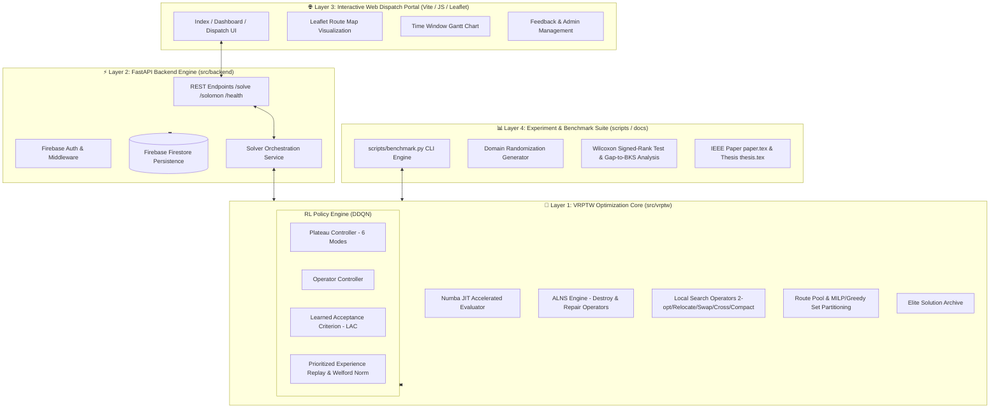

# 🚛 Phân Tích Kiến Trúc & Định Hướng Phát Triển Dự Án VRPTW Research Optimization

> **Tác giả:** Antigravity AI Assistant & VRPTW Optimization Team  
> **Ngày lập:** 23/07/2026  
> **Dự án:** Tối ưu hóa Bài toán Lộ trình Xe có Cửa sổ Thời gian (VRPTW) bằng thuật toán lai Deep Reinforcement Learning (DDQN) & Metaheuristic (ALNS)

---

## 📋 1. Tổng Quan Dự Án (Project Overview)

Dự án **VRPTW Research Optimization** là một hệ thống nghiên cứu & ứng dụng thực tiễn tiên tiến nhằm giải quyết **Bài toán Lộ trình Xe có Cửa sổ Thời gian (Vehicle Routing Problem with Time Windows - VRPTW)**.

### Mục tiêu cốt lõi:
1. **Nghiên cứu khoa học (Research Benchmark)**: Đề xuất và đánh giá mô hình thuật toán lai **Hybrid DDQN-ALNS** (Deep Double Q-Network kết hợp Adaptive Large Neighborhood Search) đối so với ALNS thuần túy, các quy tắc heuristic cố định (`Hybrid-Fixed`, `Hybrid-Rule`), và giải pháp Google OR-Tools CP-SAT trên bộ dữ liệu chuẩn quốc tế **Solomon (56 instances - 100 khách hàng)** và **Gehring & Homberger (200, 400, 600, 800, 1000 khách hàng)**.
2. **Sản phẩm ứng dụng (Commercial Web Dispatch Portal)**: Xây dựng một cổng điều phối vận tải trực quan hóa (Dispatching Portal) hoàn chỉnh với kiến trúc Web App hiện đại (FastAPI + Vite + Firebase Auth/Firestore + Leaflet Maps), cho phép nhập dữ liệu thực tế, theo dõi live progress và tối ưu lộ trình xe theo thời gian thực.

---

## 🏗️ 2. Tất Tần Tật Về Kiến Trúc Hệ Thống (System Architecture Deep Dive)

Hệ thống được thiết kế phân lớp mô-đun hóa (Modular Layered Architecture) chặt chẽ giữa các thành phần tính toán thuật toán, backend service, frontend UI và bộ công cụ thực nghiệm.



---

### 2.1 Layer 1: Core Solver & RL Architecture (`src/vrptw`)

Nằm tại thư mục `src/vrptw/`, đây là trái tim tính toán của dự án với hiệu năng cao:

1. **Numba JIT Acceleration Engine (`core.py`, `numba_kernels.py`)**:
   - Sử dụng Numba JIT để biên dịch các hàm tính toán khoảng cách Euclidean, kiểm tra tính khả thi cửa sổ thời gian ($[a_i, b_i]$), thời gian chờ ($w_i$), và vi phạm tải trọng ($q_i \le Q$) xuống mã máy. Tốc độ kiểm tra nghiệm tiệm cận native C++.

2. **Adaptive Large Neighborhood Search Engine (`operators.py`, `heuristics.py`, `local_search.py`)**:
   - **8 Destroy Operators**: Random, Shaw/Similarity, Worst-Cost, Time-Window, Route-Removal, Cluster-Removal, Spatial-Radial, Continuous-Time.
   - **5 Repair Operators**: Greedy Insertion, Regret-2, Regret-3, Regret-4, Deep-Greedy.
   - **Local Search Enhancement**: Tích hợp các toán tử tìm kiếm cục bộ 2-opt, Relocate, Swap, Cross-exchange và Route-compact để tối ưu sâu lộ trình đơn và cặp lộ trình.

3. **Deep Double Q-Network (DDQN) & RL Controllers (`rl.py`, `solvers.py`)**:
   - **Plateau Controller**: Theo dõi độ bế tắc của quá trình tìm kiếm (stagnation counter) và quyết định chuyển đổi giữa **6 Search Modes**:
     - `default`: Tìm kiếm ALNS tiêu chuẩn.
     - `intensify`: Tăng cường khai thác vùng nghiệm tốt.
     - `diversify`: Mở rộng tìm kiếm thoát cực trị cục bộ.
     - `tw_rescue`: Tập trung sửa chữa các vi phạm cửa sổ thời gian.
     - `pool_recombine`: Kích hoạt tái hợp tuyến đường từ `RoutePool`.
     - `route_reduce`: Kích hoạt chế độ ép giảm số lượng xe ($NV$).
   - **Operator Controller**: Dự đoán Q-value cho từng cặp Destroy/Repair operator dựa trên trạng thái không gian giải (solution state features).
   - **Learned Acceptance Criterion (LAC)**: Mạng neural thay thế Simulated Annealing truyền thống để đưa ra quyết định chấp nhận nghiệm mới thích ứng theo tiến trình.
   - **Prioritized Experience Replay (PER) & Welford Normalizer**:Sampling kinh nghiệm dựa trên TD-Error kết hợp chuẩn hóa Online Reward bằng thuật toán Welford giúp DDQN huấn luyện ổn định trên nhiều quy mô dữ liệu khác nhau.

4. **Route Pool & Elite Archive (`pool.py`, `rl.py`)**:
   - `RoutePool`: Thu thập các tuyến đường chất lượng cao (valid, low-cost) xuất hiện trong suốt quá trình chạy ALNS/DDQN. Sử dụng mô hình Set Partitioning (giải bằng MILP với OR-Tools hoặc Greedy Heuristic) để ghép các tuyến đường lẻ thành lộ trình toàn cục tối ưu mới.
   - `EliteArchive`: Lưu trữ Top-K nghiệm xuất sắc nhất để tái khởi động hoặc đa dạng hóa quần thể nghiệm.

---

### 2.2 Layer 2: Backend API Service (`src/backend`)

Thư mục `src/backend/` triển khai RESTful Service chuẩn công nghiệp:

- **FastAPI Framework**: Hỗ trợ asynchronous I/O, tự động tạo OpenAPI docs (`/docs`).
- **Endpoints**:
  - `/api/v1/solve`: Tiếp nhận dữ liệu VRPTW tùy chỉnh (khách hàng, tọa độ, cửa sổ thời gian, tải trọng xe) và chạy solver bất đồng bộ.
  - `/api/v1/solomon`: Cung cấp danh sách và chi tiết các bài toán benchmark chuẩn Solomon.
  - `/api/v1/health` & `/api/v1/config`: Kiểm tra sức khỏe dịch vụ và thông số cấu hình.
- **Persistence & Security**: Tích hợp Firebase Firestore lưu trữ lịch sử lộ trình và Firebase Auth (JWT Tokens) quản lý phân quyền người dùng và admin feedback.

---

### 2.3 Layer 3: Web Dispatch Portal (`src/frontend`, `web/`)

Giao diện người dùng Web SPA (Single Page Application) hiện đại:

- **Interactive Route Map**: Sử dụng Leaflet.js để hiển thị trực quan các trạm khách hàng, Depot, và vẽ luồng di chuyển của từng xe theo mã màu riêng biệt.
- **Time Window Timeline (Gantt Chart)**: Hiển thị trực quan mốc thời gian xe đến, thời gian chờ, thời gian phục vụ và thời hạn cửa sổ thời gian của khách hàng.
- **Live Progress & Controls**: Dashboard theo dõi chỉ số $NV$ (số xe) và $TD$ (tổng khoảng cách) cập nhật theo thời gian thực trong quá trình solver tính toán.

---

### 2.4 Layer 4: Experimentation & Research Pipeline (`scripts/`, `docs/`)

- **Unified Benchmark CLI (`scripts/benchmark.py`)**: Đơn giản hóa toàn bộ luồng chạy thực nghiệm thông qua các lệnh `prepare`, `run`, `monitor`, `analyze`, `clean`.
- **Domain Randomization & Transfer Learning (`generate_vrp_distribution.py`, `.safetensors`)**: Cho phép huấn luyện trước mô hình RL trên các phân phối dữ liệu ngẫu nhiên (synthetic instances), sau đó chuyển giao tri thức (transfer) sang giải các bài toán thực tế mà không cần huấn luyện lại từ đầu.
- **Academic Reporting (`docs/paper.tex`, `docs/thesis.tex`)**: Lưu trữ toàn bộ mã nguồn LaTeX của bài báo nghiên cứu chuẩn IEEE và luận văn hoàn chỉnh.

---

## 📊 3. Phát Hiện Thực Nghiệm Cốt Lõi (Core Benchmark Findings)

Dự án tuân thủ nghiêm ngặt tính trung thực khoa học với các kết luận thực nghiệm chính sau:

1. **Yêu Cầu Strict Cold-Starts**:
   - Đã loại bỏ hoàn toàn hiện tượng "Warm-Start" do dùng chung `EliteArchive` giữa các lần chạy nối tiếp (vốn làm sai lệch kết quả $NV$ xuống thấp giả tạo). Khi chạy Cold-start từ nền tảng `build_greedy`, kết quả đạt độ lặp lại và tin cậy 100%.

2. **Đặc Tính Phân Phân Theo Quy Mô (Scale-Aware Divergence)**:
   - **Quy mô 200 khách hàng (Homberger-200)**: Cả `ALNS-Base` và `Hybrid-DDQN` đều chạm tới "sàn số lượng xe" ($NV$ floor). Tuy nhiên, `Hybrid-DDQN` vượt trội ở tính **ổn định** (đạt sàn $NV$ trong 100% lần chạy so với 30%–70% của ALNS-Base) và **tối ưu tổng khoảng cách $TD$** (giảm gap từ **1.75% đến 4.07%** khi số xe ngang bằng).
   - **Quy mô 400 khách hàng (Homberger-400)**: Ở quy mô cực lớn này, `Hybrid-DDQN` thể hiện ưu thế giảm số xe ($NV$) có ý nghĩa thống kê so với `ALNS-Base` (ví dụ trên `c2_4_1` với $p=0.0078$ và `r2_4_1` với $p=0.0156$ theo kiểm định Wilcoxon).

3. **Chi Phí Tính Toán (Computational Overhead)**:
   - `Hybrid-DDQN` là chiến lược **tối đa hóa chất lượng nghiệm** (tráo đổi ngân sách thời gian lấy chất lượng lộ trình), chạy chậm hơn $1.5\times - 4\times$ trên Solomon-100 và $2\times - 100\times$ trên Homberger-400 so với ALNS thuần túy.

---

## 🚀 4. Lộ Trình Phát Triển Trong Tương Lai (Future Roadmap & Architecture Plan)

Để nâng tầm dự án từ một công trình nghiên cứu xuất sắc thành một giải pháp tối ưu hóa vận tải quy mô công nghiệp thế hệ mới, các định hướng phát triển được chia thành 4 trụ cột chính:

```mermaid
timeline
    title Lộ Trình Phát Triển VRPTW Optimization (Roadmap)
    section Giai đoạn 1: Core Acceleration
        C++ / Rust Core Engine : Chuyển đổi module Numba JIT & Operators sang Rust/C++ để loại bỏ GIL
        GNN / Transformer Policy : Thay thế MLP DDQN bằng Graph Attention Networks (GAT)
    section Giai đoạn 2: Advanced VRP Variants
        Dynamic Real-Time VRPTW : Hỗ trợ chèn đơn hàng thời gian thực & dữ liệu giao thông live
        Electric & Multi-Depot : Mở rộng EVRPTW (xe điện/trạm sạc) & MDVRPTW (đa kho bãi)
    section Giai đoạn 3: Cloud & Enterprise Architecture
        Distributed GPU Worker Pool : Kiến trúc Serverless / Kubernetes Auto-scaling cho solver
        Real-time WebSockets : Cập nhật tiến độ giải đa luồng qua WebSockets / SSE
    section Giai đoạn 4: Multi-Objective AI
        Interactive Pareto Front : Cho phép chọn đánh đổi giữa Xe (NV), Phí (TD) và Cân bằng tải làm việc
```

---

### 4.1 Trụ Cột 1: Tối Ưu Tốc Độ Engine Cốt Lõi (Core Engine Performance & AI Architecture)

#### 🛠️ 1. Chuyển đổi lõi tính toán sang Rust / C++ (PyO3 Engine)
* **Vấn đề hiện tại**: Python Numba JIT rất nhanh cho tính toán ma trận đơn luồng, nhưng vẫn dính rào cản Global Interpreter Lock (GIL) và overhead khi chuyển đổi dữ liệu Python-C trong các vòng lặp Local Search sâu.
* **Giải pháp**:
  - Viết lại toàn bộ module `core`, `operators`, `local_search` bằng **Rust** (sử dụng `PyO3` / `cbindgen`) hoặc **C++20**.
  - Thực thi đa luồng song song thực sự (True Multi-threading Parallel Search) trên tất cả các nhân CPU mà không bị rào cản GIL.
  - Dự kiến tăng tốc độ ALNS & Local Search từ **$5\times$ đến $20\times$**, mở ra khả năng chạy $100.000$ vòng lặp trong vài giây.

#### 🧠 2. Nâng cấp Mô hình RL thành Graph Neural Networks (GNN / Transformer)
* **Vấn đề hiện tại**: DDQN hiện dùng mạng Multi-Layer Perceptron (MLP) dựa trên các đặc trưng thủ công (hand-crafted features) của trạng thái nghiệm.
* **Giải pháp**:
  - Tích hợp **Graph Attention Network (GAT)** hoặc **Pointer Networks / Transformer Architecture** (đã có bước khởi tạo tại `src/vrptw/gnn.py`).
  - GNN sẽ mã hóa trực tiếp cấu trúc đồ thị không gian (khách hàng, khoảng cách, cửa sổ thời gian) thành các vector nhúng (embeddings).
  - Cho phép chính sách RL hiểu sâu về hình thái địa lý và mối quan hệ cửa sổ thời gian giữa các cụm khách hàng, tăng khả năng Generalization (tổng quát hóa) khi chuyển giao sang các bản đồ hoàn toàn mới.

---

### 4.2 Trụ Cột 2: Mở Rộng Biến Thể Bài Toán Thực Tế (Real-World VRP Variants)

#### 🚚 1. Dynamic & Online VRPTW (Giải Theo Thời Gian Thực)
* **Mô tả**: Trong thực tế, các đơn hàng mới liên tục xuất hiện trong ngày (Dynamic Orders) và điều kiện giao thông thay đổi (Traffic Congestion).
* **Tính năng mới**:
  - Cơ chế **Fast Order Insertion & Re-optimization**: Cho phép chèn đơn hàng khẩn cấp vào lộ trình hiện tại mà không cần giải lại từ đầu.
  - Tích hợp API bản đồ thực tế (OSRM / Google Maps API) để cập nhật ma trận thời gian di chuyển thực tế theo thời gian trong ngày (Time-Dependent VRPTW).

#### 🔋 2. EVRPTW & MDVRPTW (Xe Điện & Đa Kho Bãi)
* **Electric Vehicle Routing (EVRPTW)**: Bổ sung ràng buộc dung lượng pin, vị trí trạm sạc, và thời gian sạc lại cho đội xe điện.
* **Multi-Depot VRPTW (MDVRPTW)**: Quản lý bài toán với nhiều kho bãi xuất phát và quay về khác nhau.
* **Heterogeneous Fleet (Đội xe không đồng nhất)**: Hỗ trợ nhiều loại xe có tải trọng ($Q_k$), chi phí cố định, và chi phí/km khác nhau.

---

### 4.3 Trụ Cột 3: Nâng Cấp Hạ Tầng Cloud & Sản Phẩm Web (Engineering & Product)

#### ☁️ 1. Distributed Cloud Solver Engine (K8s / Serverless Workers)
* **Mô tả**: Đưa bộ giải lên hạ tầng Cloud cho phép mở rộng linh hoạt.
* **Kiến trúc**:
  - Đóng gói Solver Workers thành các Container Docker siêu nhẹ.
  - Sử dụng **Celery / Redis / RabbitMQ** làm Hàng đợi tác vụ (Job Queue).
  - Tự động Scale-out số lượng Worker theo số bài toán cần giải đồng thời.

#### 📡 2. Real-Time WebSockets Streaming
* **Nâng cấp**: Thay thế cơ chế Polling HTTP hiện tại bằng **WebSockets / Server-Sent Events (SSE)**.
* **Trải nghiệm**: Giao diện web hiển thị lộ trình xe vẽ dần trên bản đồ theo thời gian thực (Real-time live animation) mỗi khi Solver tìm thấy nghiệm tốt hơn.

---

### 4.4 Trụ Cột 4: Tối Ưu Hóa Đa Mục Tiêu (Multi-Objective Optimization & Decision Analytics)

#### ⚖️ 1. Đa Mục Tiêu Pareto (Pareto-Front Optimization)
* Trong thực tế, doanh nghiệp không chỉ muốn giảm Tổng khoảng cách ($TD$), mà còn muốn:
  1. Giảm số lượng xe ($NV$).
  2. **Cân bằng tải giữa các tài xế** (Workload Balance - tránh việc 1 xe đi 10h, 1 xe đi 2h).
  3. **Tối thiểu hóa rủi ro vi phạm muộn** (Robustness to Delay).
* **Tính năng**: Xây dựng thuật toán **NSGA-II / MOEA/D** kết hợp RL để xuất ra tập nghiệm Pareto Front. Người quản lý vận tải có thể kéo thanh trượt trên Web UI để chọn lộ trình ưu tiên Tiết kiệm chi phí hay Cân bằng công việc.

---

## 🎯 5. Tổng Kết

Dự án **VRPTW Research Optimization** đã đạt được nền móng vững chắc với:
- Thuật toán **Hybrid DDQN-ALNS** chứng minh hiệu quả vượt trội về tính ổn định và tối ưu $TD$ trên bộ dữ liệu chuẩn.
- Hệ thống **Web Dispatch Portal** hoàn chỉnh từ Backend đến Frontend.
- Tính **minh bạch và chuẩn mực nghiên cứu khoa học** cao.

Việc triển khai lộ trình phát triển tương lai (Rust Core, GNN Embeddings, Dynamic VRPTW, Cloud Native Architecture) sẽ biến dự án thành một **Nền tảng Tối ưu hóa Vận tải Thế hệ Mới (Next-Gen Logistics Optimization Platform)** hàng đầu cả trong nghiên cứu lẫn ứng dụng thương mại.
