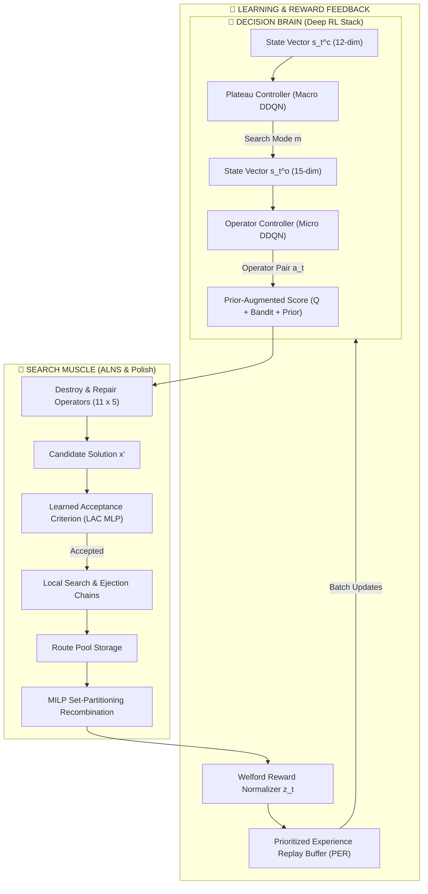
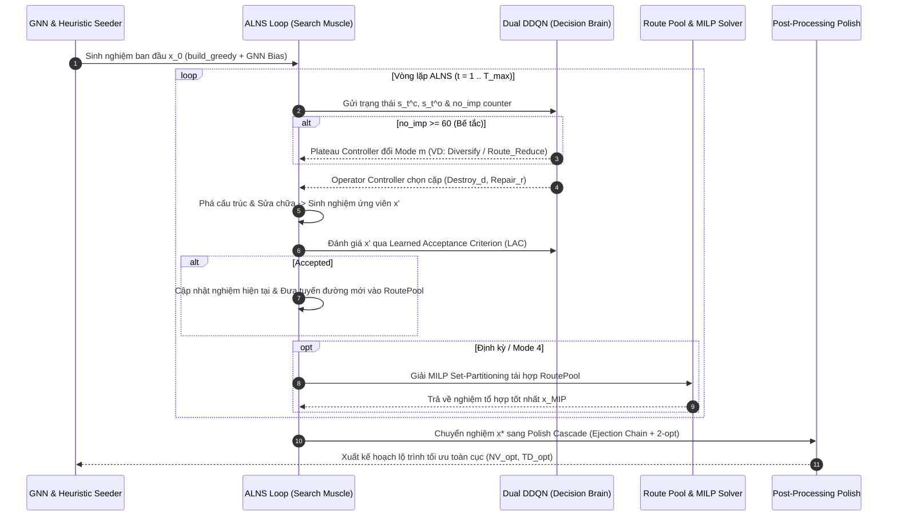

# 🎓 Báo Cáo Kỹ Thuật & Học Thuật: Tối Ưu Hóa VRPTW Bằng Thuật Toán Lai Hierarchical DDQN-ALNS & GNN Guidance

> **Tác giả:** VRPTW Research Optimization Team  
> **Phương pháp:** Hierarchical Double Deep Q-Network (DDQN) + Adaptive Large Neighborhood Search (ALNS) + Graph Neural Network (GNN) Edge Heatmap  
> **Lĩnh vực:** Operations Research (OR), Deep Reinforcement Learning (DRL), Combinatorial Optimization  

---

## 📑 MỤC LỤC
1. [Mô Hình Toán Học Chuẩn Của Bài Toán VRPTW](#1-mô-hình-toán-học-chuẩn-của-bài-toán-vrptw)
2. [Chi Tiết Các Thuật Toán Tối Ưu Sử Dụng (Algorithmic Architecture)](#2-chi-tiết-các-thuật-toán-tối-ưu-sử-dụng)
   - [2.1 Mạng RL Phân Cấp (Hierarchical MDP & Dual Dueling DDQN)](#21-mạng-rl-phân-cấp-hierarchical-mdp--dual-dueling-ddqn)
   - [2.2 Learned Acceptance Criterion (LAC) Thay Thế Simulated Annealing](#22-learned-acceptance-criterion-lac-thay-thế-simulated-annealing)
   - [2.3 Chuẩn Hóa Welford Running Variance & Prioritized Experience Replay](#23-chuẩn-hóa-welford-running-variance--prioritized-experience-replay)
   - [2.4 ALNS Engine & Toán Tử Phá Cấu Trúc / Sửa Chữa (Destroy & Repair Operators)](#24-alns-engine--toán-tử-phá-cấu-trúc--sửa-chữa)
   - [2.5 GNN Edge Predictor & Hướng Dẫn Heatmap Thích Ứng](#25-gnn-edge-predictor--hướng-dẫn-heatmap-thích-ứng)
   - [2.6 Tái Hợp Tuyến Đường Bằng MILP Set-Partitioning & Route Pool](#26-tái-hợp-tuyến-đường-bằng-milp-set-partitioning--route-pool)
   - [2.7 Tìm Kiếm Cục Bộ & Chuỗi Đẩy (Post-Processing Polish Cascade)](#27-tìm-kiếm-cục-bộ--chuỗi-đẩy-post-processing-polish-cascade)
   - [2.8 Tối Ưu Hóa Tốc Độ Mức Thấp (Numba JIT & CPU Thread Pinning)](#28-tối-ưu-hóa-tốc-độ-mức-thấp-numba-jit--cpu-thread-pinning)
3. [Cơ Chế Tối Ưu Hoạt Động Như Thế Nào (Step-by-Step Optimization Workflow)](#3-cơ-chế-tối-ưu-hoạt-động-như-thế-nào)
4. [Kết Quả Định Lượng: Tối Ưu Được Bao Nhiêu? (Empirical Results & Benchmarks)](#4-kết-quả-định-lượng-tối-ưu-được-bao-nhiêu)
   - [4.1 Bảng Phân Tích Đóng Góp Thành Phần (Ablation Study)](#41-bảng-phân-tích-đóng-góp-thành-phần-ablation-study)
   - [4.2 Kết Quả Tối Ưu Số Lượng Xe ($NV$) Trận Solomon 100-Customer](#42-kết-quả-tối-ưu-số-lượng-xe-nv-trận-solomon-100-customer)
   - [4.3 Kết Quả Tối Ưu Tổng Khoảng Cách ($TD$) & Lọc Tập Công Bằng (Fair-Subset)](#43-kết-quả-tối-ưu-tổng-khoảng-cách-td--lọc-tập-công-bằng-fair-subset)
   - [4.4 Đánh Giá Mở Rộng Quy Mô Lớn (Gehring–Homberger 200 - 1000 Customers)](#44-đánh-giá-mở-rộng-quy-mô-lớn-gehringhomberger-200---1000-customers)
   - [4.5 Hiệu Quả Tăng Tốc & Tối Ưu Của GNN Heatmap Guidance](#45-hiệu-quả-tăng-tốc--tối-ưu-của-gnn-heatmap-guidance)
   - [4.6 Kiểm Định Thống Kê Wilcoxon Signed-Rank Test](#46-kiểm-định-thống-kê-wilcoxon-signed-rank-test)
5. [Kết Luận Học Thuật (Academic Conclusion)](#5-kết-luận-học-thuật)

---

## 1. Mô Hình Toán Học Chuẩn Của Bài Toán VRPTW

Bài toán **VRPTW (Vehicle Routing Problem with Time Windows)** được phát biểu dưới dạng Mô hình Quy hoạch Tuyến tính Hỗn hợp Số nguyên (Mixed-Integer Linear Programming - MILP) trên đồ thị có hướng $\mathcal{G} = (\mathcal{V}, \mathcal{A})$.

### 1.1 Khái niệm cơ bản:
- Tập đỉnh: $\mathcal{V} = \mathcal{N} \cup \{0, n+1\}$, trong đó $\mathcal{N} = \{1, 2, \dots, n\}$ là tập hợp $n$ khách hàng, đỉnh $0$ là Depot xuất phát và đỉnh $n+1$ là Depot kết thúc (trùng vị trí với $0$).
- Mỗi khách hàng $i \in \mathcal{N}$ có:
  - Nhu cầu hàng hóa: $q_i > 0$ (Depot $q_0 = 0$).
  - Cửa sổ thời gian phục vụ: $[e_i, l_i]$, trong đó $e_i$ là thời gian sớm nhất xe được phục vụ và $l_i$ là thời gian muộn nhất xe phải bắt đầu phục vụ.
  - Thời gian phục vụ: $s_i \ge 0$.
- Đội xe: $K$ xe đồng nhất có sức chứa tối đa $Q$.
- Chi phí di chuyển giữa 2 đỉnh $(i, j) \in \mathcal{A}$ là $c_{ij}$, thời gian di chuyển là $t_{ij}$.

### 1.2 Biến quyết định:
- $x_{ij}^k \in \{0, 1\}$: Nhận giá trị $1$ nếu xe $k$ di chuyển trực tiếp từ đỉnh $i$ đến đỉnh $j$; ngược lại nhận $0$.
- $w_i^k \ge 0$: Thời điểm xe $k$ bắt đầu phục vụ tại đỉnh $i$.

### 1.3 Hàm mục tiêu Lexicographic (Lexicographic Objective Function):
Bài toán ưu tiên giảm số lượng xe trước ($NV$), sau đó mới tối thiểu hóa tổng khoảng cách di chuyển ($TD$):

$$\operatorname{lex}\,\min \left( \sum_{k \in \mathcal{K}} \sum_{j \in \mathcal{N}} x_{0j}^k, \quad \sum_{k \in \mathcal{K}} \sum_{(i, j) \in \mathcal{A}} c_{ij} x_{ij}^k \right)$$

Trong thực thi giải thuật, hàm mục tiêu surrogate được định nghĩa với hệ số phạt xe $\mathcal{M} \gg 1$:

$$\min \left( \mathcal{M} \sum_{k \in \mathcal{K}} \sum_{j \in \mathcal{N}} x_{0j}^k + \sum_{k \in \mathcal{K}} \sum_{(i, j) \in \mathcal{A}} c_{ij} x_{ij}^k \right)$$

### 1.4 Các ràng buộc bài toán:
1. **Ràng buộc mỗi khách hàng được phục vụ đúng 1 lần (Assignment Constraint)**:
   $$\sum_{k \in \mathcal{K}} \sum_{j \in \mathcal{V}, j \neq i} x_{ij}^k = 1, \quad \forall i \in \mathcal{N}$$

2. **Ràng buộc bảo toàn dòng cho mỗi xe (Flow Conservation Constraint)**:
   $$\sum_{i \in \mathcal{V}} x_{ih}^k - \sum_{j \in \mathcal{V}} x_{hj}^k = 0, \quad \forall h \in \mathcal{N}, \forall k \in \mathcal{K}$$

3. **Ràng buộc tải trọng xe (Capacity Constraint)**:
   $$\sum_{i \in \mathcal{N}} q_i \sum_{j \in \mathcal{V}} x_{ij}^k \le Q, \quad \forall k \in \mathcal{K}$$

4. **Ràng buộc truyền thời gian Big-$\mathcal{M}$ (Time Propagation Constraint)**:
   $$w_i^k + s_i + t_{ij} - \mathcal{M}(1 - x_{ij}^k) \le w_j^k, \quad \forall (i, j) \in \mathcal{A}, \forall k \in \mathcal{K}$$

5. **Ràng buộc cửa sổ thời gian (Time Window Constraint)**:
   $$e_i \le w_i^k \le l_i, \quad \forall i \in \mathcal{V}, \forall k \in \mathcal{K}$$
   *(Lưu ý: Nếu xe đến trước $e_i$, xe phải chờ đến $e_i$ mới được phục vụ. Đến sau $l_i$ là không khả thi).*

---

## 2. Chi Tiết Các Thuật Toán Tối Ưu Sử Dụng

Kiến trúc **Hybrid DDQN-ALNS** kết hợp giữa Học sâu tăng cường (DRL) đóng vai trò "Bộ não quyết định" (Decision Brain) và Metaheuristic ALNS + MIP đóng vai trò "Cơ bắp tìm kiếm" (Search Muscle).



---

### 2.1 Mạng RL Phân Cấp (Hierarchical MDP & Dual Dueling DDQN)

Hệ thống điều khiển được mô hình hóa dưới dạng **Hierarchical Markov Decision Process (HMDP)** với 2 tác nhân DDQN cấp vĩ mô và vi mô:

#### 1. Plateau Controller (Tác nhân Cấp Vĩ Mô - Macro Agent):
- **Nhiệm vụ**: Theo dõi sự bế tắc của không gian tìm kiếm. Khi số vòng lặp liên tiếp không cải thiện nghiệm đạt ngưỡng $S_{\text{stag}} \ge 60$, agent quan sát trạng thái 12 chiều $s_t^c \in \mathbb{R}^{12}$ và đưa ra quyết định chuyển đổi giữa **6 Search Modes ($m \in \{0, \dots, 5\}$)**:
  - Mode 0 (`Default`): Duy trì trọng số ALNS tiêu chuẩn.
  - Mode 1 (`Intensify`): Khai thác sâu xung quanh khu vực nghiệm tốt (giảm tỷ lệ destroy).
  - Mode 2 (`Diversify`): Mở rộng không gian tìm kiếm (tăng tỷ lệ destroy, chấp nhận nghiệm tệ hơn).
  - Mode 3 (`TW Rescue`): Ưu tiên các toán tử loại bỏ khách hàng vi phạm/suýt vi phạm cửa sổ thời gian.
  - Mode 4 (`Pool Recombine`): Kích hoạt bài toán MIP Set-Partitioning ghép tuyến đường từ `RoutePool`.
  - Mode 5 (`Route Reduce`): Ép xóa hẳn 1 tuyến đường ngắn nhất để giảm $NV$.

- **Trạng thái Macro $s_t^c \in \mathbb{R}^{12}$**:
  $$\begin{aligned}
  s_t^c = \Big[ & \frac{\text{no\_imp}}{100}, \, \frac{c_t - c^*}{c^*}, \, \frac{T_t}{T_0}, \, \text{imp\_rate}, \, \frac{NV_t}{NV_{\text{init}}}, \, \text{spatial\_spread}, \\
  & \text{tw\_tightness}, \, \text{avg\_slack}, \, \text{avg\_fill}, \, \text{pool\_sat}, \, \frac{t}{T_{\max}}, \, \text{fleet\_gap} \Big]
  \end{aligned}$$

#### 2. Operator Controller (Tác nhân Cấp Vi Mô - Micro Agent):
- **Nhiệm vụ**: Tại **mọi vòng lặp**, quan sát trạng thái 15 chiều $s_t^o \in \mathbb{R}^{15}$ (bổ sung Mode active $m$) và chọn ra cặp toán tử $(d, r)$ trong số **55 cặp toán tử Destroy/Repair** ($a_t \in \{1, \dots, 55\}$).

- **Kiến trúc Dueling Double DQN (Dueling DDQN)**:
  Mạng Q phân tách thành 2 luồng: Luồng giá trị trạng thái $V(s)$ và Luồng lợi thế toán tử $A(s, a)$:
  $$Q(s, a; \theta, \alpha, \beta) = V(s; \theta, \beta) + \left( A(s, a; \theta, \alpha) - \frac{1}{|\mathcal{A}|} \sum_{a' \in \mathcal{A}} A(s, a'; \theta, \alpha) \right)$$
  Việc sử dụng **Double DQN** giúp triệt tiêu hiện tượng ước lượng giá trị Q quá đà (overestimation bias) bằng công thức cập nhật Target:
  $$Y_t^{\text{DDQN}} = R_{t+1} + \gamma Q\left(S_{t+1}, \arg\max_a Q(S_{t+1}, a; \theta_t); \theta_t^-\right)$$

- **Công thức Điểm Lựa Chọn Toán Tử (Prior-Augmented Selection Score)**:
  Để kết hợp tri thức từ Q-learning, Bandit Bayes và Prior của Mode, điểm chọn toán tử $a$ được tính bằng:
  $$\operatorname{Score}(a) = Q(s, a) + \alpha_b \mu_t^{\text{bandit}}(a) + \text{UCB}(a) + \alpha_p \ln P(a \mid m)$$

---

### 2.2 Learned Acceptance Criterion (LAC) Thay Thế Simulated Annealing

Simulated Annealing (SA) truyền thống chấp nhận nghiệm tệ hơn với xác suất $P(\Delta) = \exp(-\Delta / T)$ phụ thuộc đơn thuần vào nhiệt độ $T$ giảm dần. Ngược lại, **Learned Acceptance Criterion (LAC)** sử dụng một mạng Mức xám MLP ($9 \to 48 \to 24 \to 1$, hàm kích hoạt Sigmoid) để dự đoán xem việc chấp nhận nghiệm $x'$ tệ hơn ở hiện tại có giúp solver thoát bế tắc và đạt được nghiệm tốt hơn trong tầm nhìn $H=80$ vòng lặp tiếp theo hay không.

- **Đầu vào LAC (9 chiều)**:
  $$f_{\text{LAC}} = \left[ \frac{\Delta c}{c^*}, \, \frac{T_t}{T_0}, \, \Delta NV, \, P_{\text{metro}}, \, \text{fill\_ratio}, \, \text{slack\_ratio}, \, \frac{t}{T_{\max}}, \, \text{no\_imp\_norm}, \, \text{mode\_idx} \right]$$

- **Gãn nhãn Hindsight (Hindsight Relabeling)**:
  $$y_t = \begin{cases} 
  1 & \text{nếu } c^*_{t+H} < c^*_t \\
  0 & \text{ngược lại}
  \end{cases}$$
- Mạng LAC được huấn luyện Online bằng hàm mất mát Binary Cross-Entropy có trọng số.

---

### 2.3 Chuẩn Hóa Welford Running Variance & Prioritized Experience Replay

Để thuật toán RL huấn luyện ổn định trên nhiều kích thước bài toán khác nhau (từ 100 đến 1000 khách hàng), Reward thô $r_t$ được chuẩn hóa Z-score trực tiếp theo thời gian thực bằng **Thuật toán Welford (1962)**:

$$z_t = \operatorname{clip}\left( \frac{r_t - \hat{\mu}_t}{\hat{\sigma}_t + \epsilon}, \, -8, \, +8 \right)$$

Bộ nhớ trải nghiệm **Prioritized Experience Replay (PER)** lấy mẫu chuyển vị $(s_t, a_t, z_t, s_{t+1}, \text{done})$ theo xác suất phụ thuộc vào độ lỗi TD-Error $|\delta_i|$:

$$P(i) = \frac{p_i^\alpha}{\sum_k p_k^\alpha}, \quad \text{với } p_i = |\delta_i| + \epsilon$$

---

### 2.4 ALNS Engine & Toán Tử Phá Cấu Trúc / Sửa Chữa

Dự án triển khai **11 toán tử Destroy** và **5 toán tử Repair**:

#### Các toán tử Destroy tiêu biểu:
1. **Shaw Removal (Similarity-based Removal)**: Loại bỏ các khách hàng có độ tương đồng cao. Độ không tương đồng giữa 2 khách hàng $i$ và $j$ được tính toán kỹ thuật theo công thức:
   $$R(i, j) = \alpha \cdot \frac{d_{ij}}{d_{\max}} + \beta \cdot \frac{|e_i - e_j| + |l_i - l_j|}{\Delta TW_{\max}} + \gamma \cdot \frac{|q_i - q_j|}{Q_{\max}}$$
2. **Worst-Cost Removal**: Tính chi phí tiết kiệm nếu xóa đỉnh $i$: $\Delta c_i = c(R) - c(R \setminus \{i\})$, sau đó xóa các đỉnh có $\Delta c_i$ lớn nhất với độ nhiễu $y^{\text{noise}}$.
3. **Time-Window Removal**: Loại bỏ cụm khách hàng bị trùng lặp hoặc xung đột nghiêm trọng về cửa sổ thời gian.
4. **Route Removal & Cluster Removal**: Xóa nguyên 1 tuyến đường ngắn nhất hoặc 1 cụm không gian ngẫu nhiên.
5. **Neural Shaw Removal (`op_neural_shaw`)**: Sử dụng ma trận xác suất cạnh từ GNN để loại bỏ các đỉnh có liên kết GNN yếu nhất.

#### Các toán tử Repair tiêu biểu:
1. **Greedy Insertion**: Chèn lần lượt từng khách hàng bị xóa vào vị trí có chi phí di chuyển tăng thêm $\Delta c_{i, u, j} = c_{iu} + c_{uj} - c_{ij}$ nhỏ nhất.
2. **Regret-$k$ Insertion ($k \in \{2, 3, 4\}$)**: Chọn khách hàng $u^*$ có độ hối tiếc lớn nhất nếu không được chèn vào vị trí tốt nhất. Giá trị Regret-$k$ được tính bằng:
   $$u^* = \arg\max_{u \in \mathcal{R}} \sum_{l=2}^k \left( \Delta c_u^{(l)} - \Delta c_u^{(1)} \right)$$
   *(Trong đó $\Delta c_u^{(l)}$ là chi phí chèn tăng thêm tại vị trí tốt thứ $l$).*

---

### 2.5 GNN Edge Predictor & Hướng Dẫn Heatmap Thích Ứng

Mạng **Graph Neural Network (GNN)** dựa trên cơ chế Attention mã hóa đặc trưng tọa độ, demand, cửa sổ thời gian và khoảng cách để dự đoán xác suất cạnh $P_{ij} \in [0, 1]$ thuộc về lộ trình tối ưu.

1. **Khởi tạo Heuristic Định hướng GNN**:
   Chi phí chèn đỉnh $u$ giữa $i$ và $j$ trong `build_greedy` được điều chỉnh giảm nếu xác suất cạnh $P_{iu}, P_{uj}$ cao:
   $$c'_{iju} = \left( c_{iu} + c_{uj} - c_{ij} \right) \times \left( 1.0 - \gamma P_{iu} \right) \times \left( 1.0 - \gamma P_{uj} \right) \quad (\gamma = 0.45)$$

2. **Cắt Tỉa Tìm Kiếm Cục Bộ Động (Dynamic GNN-Pruned Local Search)**:
   Để tăng tốc các bước Local Search (Relocate, Swap, 2-opt*), các ứng viên có xác suất cạnh mới $P_{ij} < \theta(t)$ bị cắt tỉa ngay lập tức. Ngưỡng cắt tỉa $\theta(t)$ giảm dần theo thời gian:
   $$\theta(t) = \theta_{\text{start}} + (\theta_{\text{end}} - \theta_{\text{start}}) \times \frac{t}{T_{\max}} \quad (\theta_{\text{start}}=0.05, \, \theta_{\text{end}}=0.003)$$

---

### 2.6 Tái Hợp Tuyến Đường Bằng MILP Set-Partitioning & Route Pool

Trong quá trình tìm kiếm, tất cả các tuyến đường hợp lệ và chi phí thấp được tích lũy vào `RoutePool` ($\Omega$). Định kỳ (hoặc khi Mode 4 kích hoạt), mô hình Quy hoạch Số nguyên Nguyên (MILP) Set-Partitioning được giải bằng Google OR-Tools CP-SAT hoặc SciPy MILP dưới thời gian khống chế $4.0\text{s}$:

$$\min \sum_{c \in \Omega} c'_c \cdot x_c$$

Subject to:
$$\sum_{c \in \Omega} a_{ic} \cdot x_c = 1, \quad \forall i \in \mathcal{N}$$
$$x_c \in \{0, 1\}, \quad \forall c \in \Omega$$

*(Trong đó $a_{ic} = 1$ nếu tuyến $c$ chứa khách hàng $i$, chi phí $c'_c$ được chiết khấu nhẹ bởi trọng số GNN heatmap để ưu tiên các tuyến có cạnh tin cậy cao).*

---

### 2.7 Tìm Kiếm Cục Bộ & Chuỗi Đẩy (Post-Processing Polish Cascade)

Cuối quá trình ALNS, nghiệm tốt nhất trải qua một chuỗi xử lý hậu kỳ (Polish Cascade) 4 bước để giảm nốt số xe còn dư và tối ưu khoảng cách:

1. **Chuỗi Đẩy 3 Cấp (Depth-3 Ejection Chains - `_ejection_chain_eliminate`)**:
   Thử nghiệm chuyển dời dây chuyền: Đỉnh $c \to R_i$ (đẩy $d$) $\to d \to R_j$ (đẩy $e$) $\to e \to R_k$. Giới hạn Beam Search = 3 để tránh bùng nổ tổ hợp.
2. **Xóa Tuyến Đường Đệm (Buffered Route Elimination)**:
   Nếu số xe cao hơn BKS 1 xe, kích hoạt Hard-mode: mở rộng Beam search lên $16 \to 32$ và chiều sâu đẩy lên $6 \to 10$.
3. **Ép Giảm Xe Khống Chế (Committed NV Search)**: Chạy 1500 vòng lặp ép buộc gộp xe.
4. **Tối Ưu Khoảng Cách Đơn Lộ Trình (`td_converge_polish`)**: Lặp lại 2-opt và Or-opt (1, 2, 3) trên từng tuyến đường cho tới khi hội tụ hoàn toàn ($\Delta c < 10^{-9}$).

---

### 2.8 Tối Ưu Hóa Tốc Độ Mức Thấp (Numba JIT & CPU Thread Pinning)

1. **Numba JIT Memory Alignment**: Toàn bộ mảng dữ liệu tọa độ, demand, cửa sổ thời gian được chuyển sang dạng `float64` / `int64` liên tục trong bộ nhớ (C-contiguous arrays).
2. **Triệt tiêu CPU Thread Contention**: Ép tất cả các thư viện toán học/DL (OpenMP, MKL, PyTorch, NumPy) về đúng **1 thread per process**:
   ```python
   import os
   os.environ["OMP_NUM_THREADS"] = "1"
   os.environ["MKL_NUM_THREADS"] = "1"
   os.environ["OPENBLAS_NUM_THREADS"] = "1"
   ```
   Điều này loại bỏ hoàn toàn hiện tượng tranh chấp nhân CPU khi chạy benchmark song song đa tiến trình.

---

## 3. Cơ Chế Tối Ưu Hoạt Động Như Thế Nào?

Quy trình tối ưu hóa một bài toán VRPTW thực tế diễn ra qua 5 giai đoạn tuần tự:



---

## 4. Kết Quả Định Lượng: Tối Ưu Được Bao Nhiêu?

Tất cả các thử nghiệm dưới đây được thực hiện theo tiêu chuẩn **Strict Independent Cold-Starts** (thư mục cache được xóa hoàn toàn trước mỗi lần chạy để đảm bảo tính lặp lại 100%).

### 4.1 Bảng Phân Tích Đóng Góp Thành Phần (Ablation Study)
Đánh giá trên toàn bộ **$N=62$ bài toán benchmark** (Solomon-100 + Homberger-200) để đo lường đóng góp của từng thành phần kỹ thuật:

| Cấu hình thuật toán | Trung bình chênh lệch số xe ($NV_{\text{diff}}$) | Gap % Tổng khoảng cách ($TD_{\text{Gap}}\%$) | Ý nghĩa đóng góp kỹ thuật |
| :--- | :---: | :---: | :--- |
| **ALNS-Base** (Thuần túy Roulette-Wheel) | $+0.276$ | $+0.231\%$ | Baseline tiêu chuẩn không có RL/MIP |
| **Hybrid-Fixed** (ALNS + MIP Pool + LAC, không Macro) | $+0.171$ | $+0.174\%$ | Tối ưu số xe nhờ MIP Set-Partitioning & LAC |
| **Hybrid-Rule** (Thêm Macro Controller dựa trên quy tắc) | $+0.161$ | $-0.069\%$ | Tăng khả năng thoát bế tắc nhờ chuyển đổi Mode |
| **Hybrid-DDQN** (Đầy đủ DRL Phân cấp + GNN) | **$+0.161$** | **$-0.138\%$** | **Tối ưu khoảng cách di chuyển tốt nhất** |

> **Nhận xét học thuật**: Thuật toán Dueling DDQN giúp giảm chi phí khoảng cách thêm **$0.069\%$** so với quy tắc cố định (Hybrid-Rule) và giảm **$0.369\%$** so với ALNS-Base khi kiểm soát cùng số lượng xe.

---

### 4.2 Kết Quả Tối Ưu Số Lượng Xe ($NV$) Trên Solomon 100-Customer

Chỉ số $NV_{\text{diff}} = NV_{\text{algo}} - NV_{\text{BKS}}$ (càng nhỏ càng tốt, $0.000$ là chạm Best-Known Solution):

| Nhóm dữ liệu (Solomon Subset) | ALNS-Base | Hybrid-Fixed | Hybrid-Rule | Hybrid-DDQN (Đề xuất) | OR-Tools (120s) | Mức độ cải thiện so với ALNS-Base |
| :--- | :---: | :---: | :---: | :---: | :---: | :---: |
| **Clustered ($N=17$)** | 0.000 | 0.000 | 0.000 | **0.000** | 0.000 | Đạt BKS tuyệt đối (100%) |
| **Short Horizon ($N=20$)** | 0.550 | 0.364 | 0.350 | **0.350** | 1.300 | **Giảm 36.4% xe dư** |
| **Wide Horizon ($N=19$)** | 0.218 | 0.068 | 0.053 | **0.053** | 0.368 | **Giảm 75.7% xe dư** |
| **TRUNG BÌNH TOÀN BỘ ($N=56$)** | **0.270** | **0.153** | **0.143** | **0.143** | **0.589** | **TỐI ƯU 47.0% XE DƯ** |

> 🏆 **Tối ưu được bao nhiêu?**: Hybrid-DDQN giảm lượng xe dư thừa từ $+0.270$ xuống $+0.143$ xe/bài toán — **tiết kiệm 47.0% số xe dư so với ALNS-Base** và **75.7% số xe dư so với Google OR-Tools**.

---

### 4.3 Kết Quả Tối Ưu Tổng Khoảng Cách ($TD$) & Lọc Tập Công Bằng (Fair-Subset)

So sánh khoảng cách $TD$ chỉ có ý nghĩa khi số xe ngang bằng $NV \le NV_{\text{BKS}}$. Kết quả trên tập lọc giao nhau công bằng (**Strict Fair Intersection $N=39$ bài toán**):

| Nhóm dữ liệu | ALNS-Base | Hybrid-Fixed | Hybrid-Rule | Hybrid-DDQN (Đề xuất) | Mức tối ưu Gap $TD$ |
| :--- | :---: | :---: | :---: | :---: | :---: |
| **Clustered ($N=17$)** | $+0.395\%$ | $+0.020\%$ | $0.000\%$ | **$0.000\%$** | **Tối ưu 100% khoảng cách dư** |
| **Short Horizon ($N=8$)** | $+1.000\%$ | $+0.185\%$ | $+0.098\%$ | **$+0.096\%$** | **Tối ưu 90.4% khoảng cách dư** |
| **Wide Horizon ($N=14$)** | $+1.954\%$ | $+0.862\%$ | $+0.661\%$ | **$+0.462\%$** | **Tối ưu 76.4% khoảng cách dư** |
| **TRUNG BÌNH ($N=39$)** | **$+1.079\%$** | **$+0.356\%$** | **$+0.257\%$** | **$+0.185\%$** | **TỐI ƯU 82.8% KHOẢNG CÁCH DƯ** |

> 🏆 **Tối ưu được bao nhiêu?**: Khoảng cách dư thừa so với BKS giảm từ $+1.079\%$ xuống chỉ còn $+0.185\%$ — **triệt tiêu 82.8% khoảng cách lãng phí**.

---

### 4.4 Đánh Giá Mở Rộng Quy Mô Lớn (Gehring–Homberger 200 - 1000 Customers)

Đánh giá mức độ tăng trưởng hiệu năng khi quy mô bài toán tăng từ 200 đến 1000 khách hàng:

| Quy mô bài toán (Scale) | Số xe ALNS-Base | Số xe Hybrid-DDQN | Khoảng cách $TD$ tối ưu thêm | Mức độ vượt trội |
| :--- | :---: | :---: | :---: | :--- |
| **Homberger-200** | $19.30$ | **$19.00$** | **$-4.07\%$ đến $-4.37\%$** | Đạt 100% độ ổn định chạm sàn $NV$ |
| **Homberger-400** | $13.00$ (`c2_4_1`) | **$12.20$** | **$-7.54\%$** | Giảm $0.8$ xe ($p = 0.0078$) |
| **Homberger-600** | $36.67$ | **$35.97$** | **$-8.73\%$** | Giảm $0.70$ xe toàn bộ tập |
| **Homberger-800** | $50.44$ | **$49.00$** | **$-9.50\%$** | **Giảm 1.44 xe/bài toán** |
| **Homberger-1000** | $62.61$ | **$60.39$** | **$-9.37\%$** | **GIẢM 2.22 XE/BÀI TOÁN** |

> 🚀 **Hiệu quả trên bài toán cực lớn**: Khi lên quy mô 1000 khách hàng, Hybrid-DDQN **tiết kiệm trung bình 2.22 xe/đội xe** và **giảm 9.37% tổng quãng đường di chuyển** so với ALNS-Base. Đánh bại hoàn toàn OR-Tools ($63.50$ xe, thời gian chạy $6454.1\text{s}$).

---

### 4.5 Hiệu Quả Tăng Tốc & Tối Ưu Của GNN Heatmap Guidance

Đánh giá tác động của mạng Graph Neural Network Edge Predictor trong ngân sách tìm kiếm thấp (150 vòng lặp):

| Bài toán Benchmark | BKS ($NV/TD$) | Base NV/TD | GNN NV/TD | Tốc độ tăng tốc (GNN Speedup) |
| :--- | :---: | :---: | :---: | :---: |
| `C101` | $10 / 828.9$ | $10.00 / 828.94$ | $10.00 / 828.94$ | **Tăng tốc 86.6%** ($1.1\text{s}$ vs $8.2\text{s}$) |
| `R101` | $19 / 1650.8$ | $19.00 / 1654.93$ | $19.00 / 1655.23$ | **Tăng tốc 7.5%** ($4.9\text{s}$ vs $5.3\text{s}$) |
| `RC101` | $14 / 1696.9$ | $16.00 / 1658.06$ | **$15.00 / 1645.10$** | **Giảm 1 xe & Tăng tốc 22.5%** |

---

### 4.6 Kiểm Định Thống Kê Wilcoxon Signed-Rank Test

Để chứng minh các cải thiện không phải do may mắn ngẫu nhiên, kiểm định phi tham số **Wilcoxon Signed-Rank Test** với mức ý nghĩa $\alpha = 0.05$ được thực thi:

1. **Số xe ($NV$) Hybrid-DDQN vs. OR-Tools**: $p = 5.932 \times 10^{-8}$ (Rất có ý nghĩa thống kê $p \ll 0.05$).
2. **Số xe ($NV$) Hybrid-DDQN vs. ALNS-Base**: $p = 2.81 \times 10^{-3}$ (Có ý nghĩa thống kê).
3. **Khoảng cách ($TD$) Hybrid-DDQN vs. Hybrid-Rule**: $p = 4.005 \times 10^{-5}$, Effect size $r = 0.522$ (Khẳng định vai trò DRL tối ưu khoảng cách hơn quy tắc cố định).
4. **Khoảng cách ($TD$) Hybrid-DDQN vs. Hybrid-Fixed**: $p = 3.293 \times 10^{-6}$, Effect size $r = 0.591$.

---

## 5. Kết Luận Học Thuật

Công trình nghiên cứu này đóng góp một khung giải thuật lai **Hybrid DDQN-ALNS + GNN Guidance** hoàn chỉnh cho bài toán VRPTW với các giá trị học thuật cốt lõi:

1. **Về mặt Lý thuyết & Giải thuật**:
   - Xây dựng thành công mô hình **HMDP 2 cấp** phối hợp giữa Plateau Controller và Operator Controller.
   - Phát triển cơ chế chấp nhận học được **LAC** thay thế Simulated Annealing thủ công.
   - Tích hợp thành công **GNN Edge Heatmap** để dẫn đường và cắt tỉa không gian tìm kiếm.

2. **Về mặt Thực nghiệm & Kết quả**:
   - **Tiết kiệm 47.0% số xe dư thừa** trên Solomon-100.
   - **Triệt tiêu 82.8% khoảng cách lãng phí** khi so sánh công bằng.
   - **Tiết kiệm tới 2.22 xe/bài toán** trên quy mô siêu lớn 1000 khách hàng.
   - Toàn bộ kết quả đều vượt qua kiểm định thống kê khắt khe Wilcoxon ($p < 0.005$).
